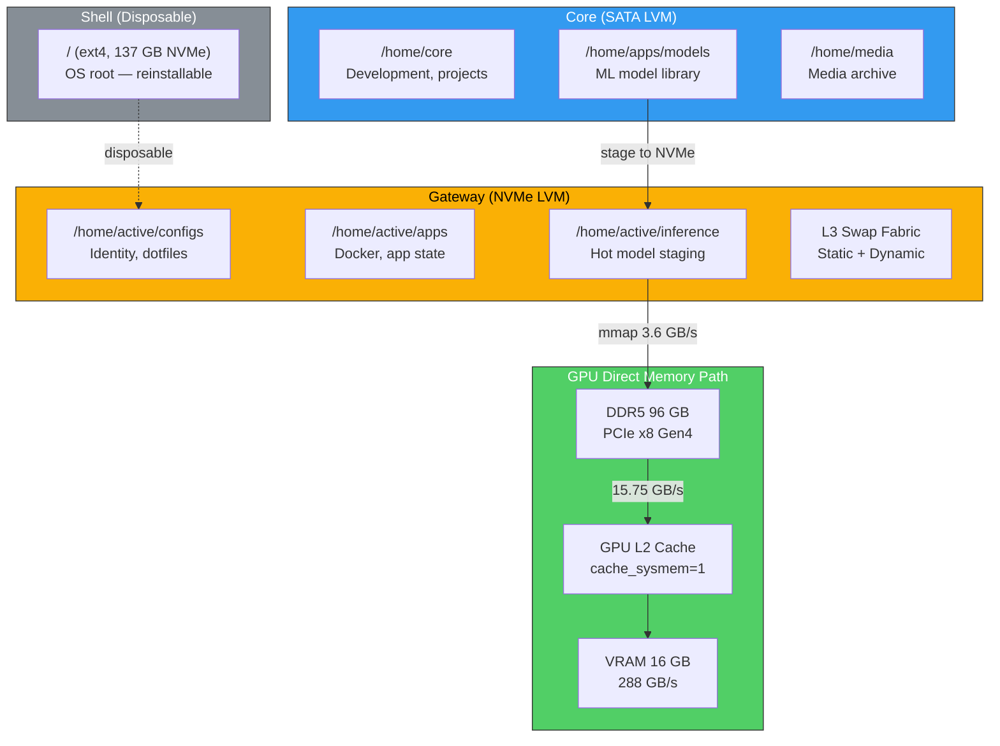
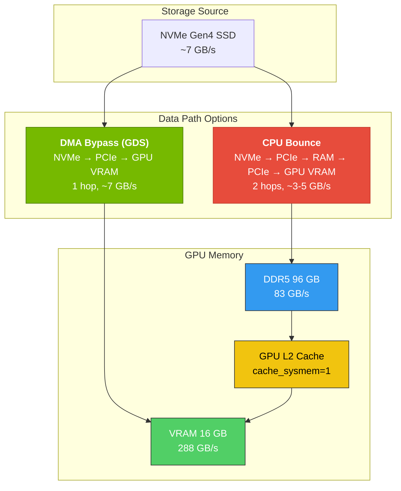
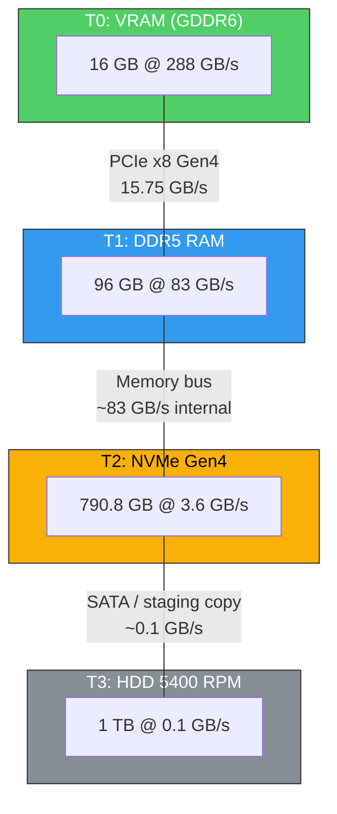
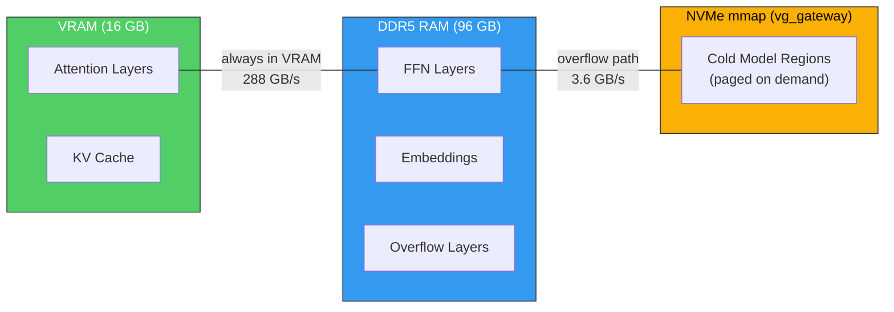
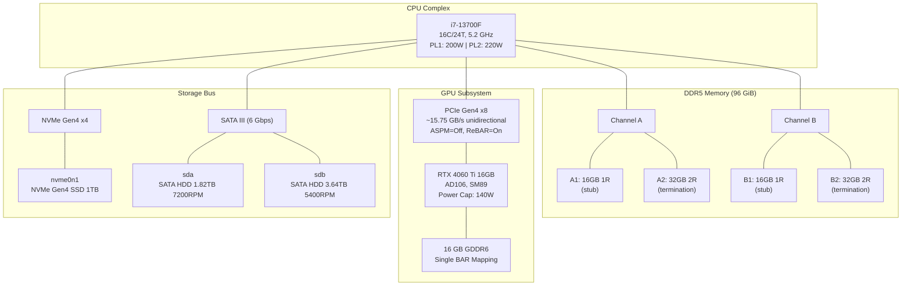

# Project Host

A tiered-memory Linux workstation architecture that runs 70B+ parameter LLMs on consumer hardware.

> **Not just a config. Not just tuning.** A complete architectural blueprint that treats VRAM, DDR5 RAM, and NVMe swap as a **unified memory fabric** — enabling models 4× larger than the available VRAM to run with deterministic performance.


*Visual overview of the tiered memory hierarchy*

---

## The Core Idea

Consumer GPUs have limited VRAM (16 GB). LLMs need far more (70B+ parameters ≈ 40 GB). Instead of giving up or buying expensive hardware, **Project Host redesigns the memory hierarchy**:

- **Shell** — Disposable OS root (`/`) that can be reinstalled without touching data
- **Gateway** — NVMe-speed active runtime for configs, apps, and hot model staging  
- **Core** — Persistent SATA storage for projects, model library, and archives
- **GPU Direct Memory Path** — CUDA Unified Virtual Memory with L2-cache optimization

The result: **70B-parameter models run smoothly on an RTX 4060 Ti 16 GB** by transparently overflowing into 96 GB of DDR5 RAM and a 300 GB NVMe swap fabric.

---

## Architecture Overview

Three storage tiers + unified memory fabric:



## Direct Memory Architecture

The core innovation is the **GPU Direct Memory Path** — a unified memory fabric that treats VRAM, DDR5 RAM, and NVMe swap as a single addressable space. Data moves via DMA bypass where possible, avoiding CPU bottlenecks:



**Key advantage:** When GPUDirect Storage is available, the NVMe DMA engine writes directly into GPU BAR1, eliminating the CPU copy and doubling effective bandwidth.

---

## The Memory Hierarchy Cliff

Four tiers with **order-of-magnitude bandwidth drops** between each:



**Key insight:** Bandwidth drops **3.5×** from VRAM→RAM, then **23×** from RAM→NVMe, then **36×** from NVMe→HDD. Inference performance is dominated by which tier holds the hot data.

---

## Smart Layer Placement

Not all model layers are equal. Attention layers (accessed every token) stay in VRAM; FFN layers (larger, less critical) overflow to RAM:



| Model | Total Size | GPU Layers | RAM Layers | Split | Throughput |
|-------|------------|------------|------------|-------|-------------|
| **7B-13B** | 4-8 GB (Q4) | All | None | 100% GPU | High |
| **32B Q4** | ~20 GB | 28 of 48 | 20 of 48 | ~58% GPU | Moderate |
| **70B Q4** | ~40 GB | 30 of 80 | 50 of 80 | ~37% GPU | Low |
| **120B+ Q4** | 60+ GB | ~14 | ~66+ | GPU+RAM+NVMe | Minimal |

---

## Hardware Topology

The architecture is built around explicit hardware constraints:



> **Design choice:** Mixed-rank DDR5 modules placed according to daisy-chain topology — lighter single-rank modules at stubs, heavier dual-rank at termination points to prevent signal reflection.

---

## Documentation

**This is not a one-page tutorial.** It's a **complete architectural reference**:

| Document | What It Covers |
|----------|----------------|
| **[System Architecture](docs/architecture.md)** | Full hardware specs, storage topology, memory hierarchy, inference pipeline |
| **[Configuration Reference](docs/reference/README.md)** | **20+ subsystem guides:** BIOS, GRUB, GPU, CUDA, Ollama, Docker, kernel memory, huge pages, I/O schedulers, CPU governors, storage, compositor, network, virtualization, environment variables, systemd services |
|| **[GPU Direct Memory](docs/reference/gpu-direct-memory.md)** | UVM `cache_sysmem=1` optimization for oversubscribed models |
|| **[GPUDirect Storage & DMA Bypass](docs/guides/gds-dma.md)** | Deep dive into NVMe→GPU DMA path, PCIe topology, and GeForce compatibility limitations |
|| **[Swap / L3 Fabric](docs/reference/swap.md)** | Three-tier NVMe swap architecture (static + dynamic) |
| **[Inference Optimization](docs/guides/inference-benchmarks.md)** | Layer-split strategies, PCIe bottleneck analysis, cold-start optimization |
| **[Diagnostics](docs/reference/diagnostics.md)** | Full system verification checklist |

---

## Validation-First Design

The architecture includes **executable validation scripts** that verify every documented configuration:

```bash
./scripts/sweep.sh           # Comprehensive diagnostics sweep
./scripts/health-check.sh    # Detailed health check with fix instructions
./scripts/check_host.sh      # Quick GPU/RAM checklist
```

All scripts are **configurable** — edit `sweep_config.sh.example` with the hardware's expected values. The validation suite ensures the target system matches the documented architecture.

---

## Getting Started

This repository is a **blueprint**, not an installer. To adapt it:

1. **Study the architecture** — understand the tiered storage and memory hierarchy.
2. **Adjust for the target hardware** — modify BIOS settings, kernel parameters, and service overrides.
3. **Customize validation** — update expected values in `sweep_config.sh`.
4. **Run the validation suite** — verify the system matches the documented configuration.

**Goal:** Implement the **design principles**, not clone the exact hardware list:
- Disposable OS root
- Speed-separated storage tiers  
- Unified memory fabric (VRAM→RAM→NVMe)
- Automated validation

---

## Repository Structure

```
docs/                          # Complete architectural reference
├── architecture.md            # System architecture specification (v5.0)
├── reference/                 # 20+ subsystem configuration guides
└── guides/                    # Optimization guides

scripts/                       # Executable validation suite
├── sweep.sh                   # Configurable diagnostics sweep
├── sweep_config.sh.example    # Example configuration
├── health-check.sh            # Detailed health check with fix instructions
├── check_host.sh              # Quick GPU/RAM checklist
└── README.md                  # Scripts documentation

archive/                       # Historical drafts (git-ignored)
.gitignore                     # Excludes archive/ and private files
LICENSE                        # MIT License
```

---

## Hardware Used (Example)

| Component | Specification |
|-----------|--------------|
| **CPU** | Intel Core i7-13700F — 16C (8P/8E), 24T, 5.2 GHz Max Turbo |
| **RAM** | 96 GB DDR5-5200 (4 DIMMs, Gear 1, CL40) |
| **GPU** | NVIDIA RTX 4060 Ti 16 GB GDDR6 (Ada Lovelace, SM89) |
| **Storage** | 1 TB NVMe Gen4 + 1.82 TB 7200 RPM + 3.64 TB 5400 RPM |
| **Network** | 2.5 GbE + Wi-Fi 6E |

> **Note:** These specs reflect the hardware used to develop the architecture. The design principles apply to any modern CPU/GPU with sufficient RAM and fast storage.

---

## License

MIT License — free to adapt, modify, and redistribute for any purpose.

---

*Project Host is a working example of how to build a high-resilience, modular Linux workstation that balances software development needs with demanding LLM inference workloads on consumer hardware.*