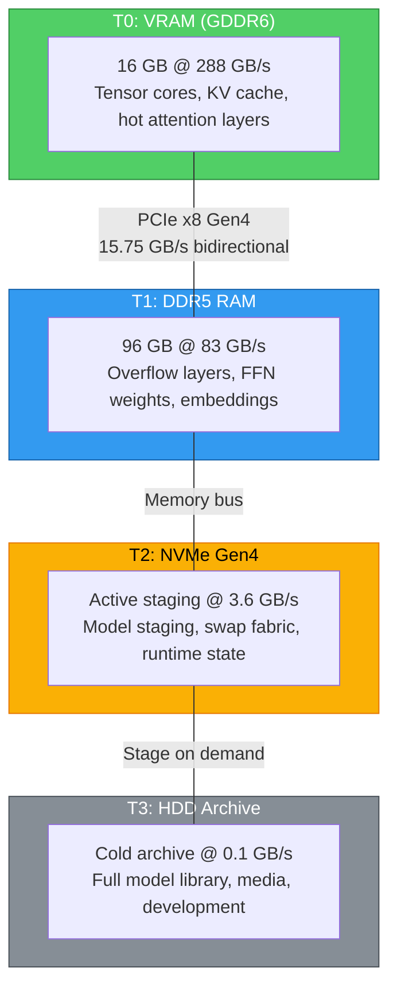
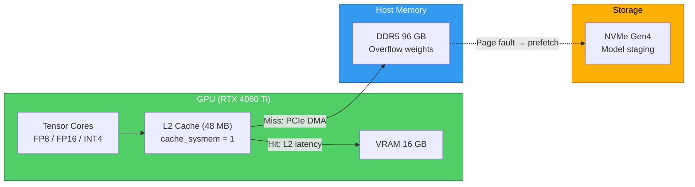
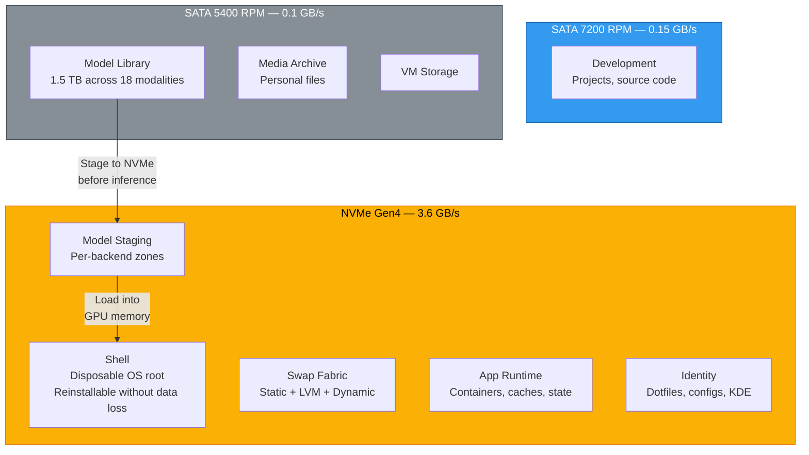
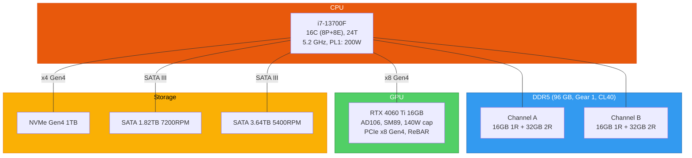

<p align="center">
  
</p>

<h1 align="center">Project Host</h1>

<p align="center">
  <strong>A tiered-memory Linux workstation architecture that runs 70B+ parameter LLMs on consumer hardware.</strong>
</p>

<p align="center">
  <a href="docs/architecture.md">Architecture Spec</a> &bull;
  <a href="docs/reference/README.md">Configuration Guides</a> &bull;
  <a href="docs/guides/inference-benchmarks.md">Benchmarks</a> &bull;
  <a href="#design-principles">Design Principles</a>
</p>

---

## Why This Exists

Consumer GPUs have 16 GB of VRAM. A 70B-parameter LLM needs ~40 GB. Rather than buying datacenter hardware, **Project Host redesigns the memory hierarchy** to treat VRAM, DDR5 RAM, and NVMe swap as a single unified memory fabric.

The result: **70B-parameter models run on an RTX 4060 Ti** by transparently overflowing into 96 GB of DDR5 and a tiered NVMe swap fabric.

This repository is the **complete architectural blueprint** — 1,750 lines of specification, 20+ subsystem guides, and executable validation scripts. It's not a config dump. It's a design reference for building high-performance inference workstations on consumer budgets.

---

## Unified Memory Fabric

Four tiers with order-of-magnitude bandwidth drops between each. The architecture ensures hot data stays in the fastest tier:



**Key insight:** Bandwidth drops **3.5x** from VRAM to RAM, then **23x** from RAM to NVMe, then **36x** from NVMe to HDD. Inference performance is dominated by which tier holds the active data.

---

## GPU Direct Memory Path

The core innovation is the **GPU L2 cache bridging** — CUDA UVM parameters allow the GPU's L2 cache to cache system RAM pages, dramatically reducing effective PCIe latency for repeated tensor access:



When a model overflows VRAM, the GPU doesn't stall — it reads overflow weights from DDR5 through PCIe, and the L2 cache ensures repeated accesses skip the bus entirely. A dedicated prefetch engine speculatively loads sequential weight pages before faults occur.

---

## Storage Architecture

Three volume groups, each on a different speed tier. No cross-drive spanning — each VG inherits its drive's performance characteristics:



### Design Principles

| Principle | Implementation |
|-----------|----------------|
| **Disposable OS** | Root partition can be wiped and rebuilt. All user data lives on LVM volumes that survive reinstalls. |
| **Speed-separated tiers** | Each volume group matches its drive's throughput. NVMe for hot data, HDD for cold storage. |
| **Models staged, never loaded from HDD** | A staging pipeline copies models from HDD archive to NVMe before inference. Cold starts take 14s from NVMe vs 206s from HDD. |
| **Signal integrity** | Mixed-rank DDR5 placed per daisy-chain topology rules (1R at stubs, 2R at termination) for stable 5200 MT/s. |
| **Thermal safety** | CPU quota capping, GPU power limits, and core affinity spreading prevent thermal emergencies under sustained inference. |
| **Validated configuration** | Every documented setting has an executable check in the validation suite. |

---

## Smart Layer Placement

Not all model layers are equal. Attention heads are accessed every token and stay in VRAM. FFN layers are larger and overflow to RAM:

| Model | Weights | GPU Layers | RAM Layers | Expected Throughput |
|-------|---------|------------|------------|---------------------|
| **7B–13B** Q4 | 4–8 GB | All | None | 40–50 tok/s |
| **32B** Q4 | ~20 GB | 28 of 48 | 20 of 48 | 5–6 tok/s |
| **70B** Q4 | ~40 GB | 30 of 80 | 50 of 80 | 1.5–2 tok/s |
| **120B+** Q4 | 60+ GB | ~14 | 66+ (+ NVMe) | < 1 tok/s |

The **PCIe x8 Gen4 link (15.75 GB/s)** sets the theoretical floor for overflow models. UVM L2 caching raises actual throughput above this floor for models with repeated access patterns.

---

## Hardware Topology



> **Design choice:** GPU and NVMe are on separate PCIe root ports — they don't share bandwidth. The GPU gets a dedicated x8 Gen4 link (15.75 GB/s), and the NVMe gets x4 Gen4 (3.6 GB/s).

---

## Documentation

This is a **complete architectural reference**, not a quick-start guide:

| Document | Coverage |
|----------|----------|
| [**System Architecture**](docs/architecture.md) | 1,750-line master spec: hardware, storage topology, memory hierarchy, boot chain, inference pipeline, systemd orchestration |
| [**Configuration Reference**](docs/reference/README.md) | 20+ subsystem guides: BIOS, GRUB, GPU, CUDA, kernel memory, huge pages, I/O schedulers, CPU governors, swap fabric, Docker, network, services |
| [**GPU Direct Memory**](docs/reference/gpu-direct-memory.md) | UVM cache optimization, prefetch tuning, Resizable BAR, PCIe relaxed ordering |
| [**GPUDirect Storage & DMA**](docs/guides/gds-dma.md) | NVMe-to-GPU DMA bypass, PCIe topology analysis, GeForce compatibility |
| [**Inference Benchmarks**](docs/guides/inference-benchmarks.md) | Layer-split strategies, PCIe bottleneck analysis, cold-start optimization, TensorRT-LLM compiled performance |
| [**Swap / L3 Fabric**](docs/reference/swap.md) | Three-tier NVMe swap architecture with dynamic expansion |
| [**Diagnostics**](docs/reference/diagnostics.md) | 25-point system verification checklist |

---

## Validation Suite

Every documented configuration has a corresponding check:

```bash
./scripts/master-sweep.sh                          # Full 111-check system sweep
./scripts/master-sweep.sh --profile inference-only  # Dedicated inference profile
./scripts/master-sweep.sh --profile benchmark       # Max performance (thermal risk)
```

The sweep validates GPU state, PCIe link, UVM parameters, kernel tunables, NVMe scheduling, storage pressure, CUDA version coherence, and 90+ other checks. Output is color-coded with fix instructions for every failure.

Three operational profiles: **workstation** (mixed-use, thermal-safe), **inference-only** (max throughput), **benchmark** (thermal risk accepted).

---

## Adapting This Architecture

This repository is a **blueprint**, not an installer. To adapt it:

1. **Study the design** — understand *why* each tier exists, not just *what* it contains
2. **Map to your hardware** — the principles scale: any modern GPU + sufficient RAM + fast storage
3. **Implement incrementally** — start with the memory fabric (UVM + swap), then add storage tiers
4. **Validate continuously** — adapt the sweep script to your hardware's expected values

### Common Gotchas

- **CUDA version mismatch** — `nvidia-smi` reports the driver's maximum capability, NOT the installed toolkit version
- **Ollama `OLLAMA_NUM_GPU`** — not a valid environment variable. GPU layer count is per-model, not per-server
- **systemd CPUQuota** — `99%` means 99% of ONE core, not total CPU. 16 cores at 98% = `1568%`
- **PCIe ASPM** — must be disabled in BIOS, not just kernel. Some boards (MSI) override the kernel parameter

---

## Repository Structure

```
docs/
├── architecture.md              # Master system specification (v5.0)
├── INFERENCE-CONFIG.md          # Validated inference runtime config
├── reference/                   # 20+ subsystem configuration guides
│   ├── gpu-direct-memory.md     # UVM cache optimization
│   ├── cuda.md                  # CUDA version management
│   ├── swap.md                  # L3 swap fabric
│   └── ...                      # BIOS, GRUB, CPU, I/O, network, etc.
└── guides/
    ├── inference-benchmarks.md  # Performance analysis
    ├── gds-dma.md               # GPUDirect Storage deep dive
    └── out-of-core-memory.md    # Out-of-core model loading

scripts/
├── master-sweep.sh              # 111-check validation suite (v5.0)
├── profiles/
│   ├── workstation.conf         # Mixed-use profile (default)
│   ├── inference-only.conf      # Dedicated inference
│   └── benchmark.conf           # Max performance
└── legacy/                      # Archived historical scripts
```

---

## Reference Hardware

| Component | Specification |
|-----------|--------------|
| **CPU** | Intel i7-13700F — 16C (8P+8E), 24T, 5.2 GHz |
| **RAM** | 96 GB DDR5-5200 (4 DIMMs, mixed-rank, Gear 1, CL40) |
| **GPU** | NVIDIA RTX 4060 Ti 16 GB (AD106, SM89, PCIe x8 Gen4) |
| **NVMe** | 1 TB Gen4 (model staging, swap fabric, OS root) |
| **HDD** | 1.82 TB 7200 RPM + 3.64 TB 5400 RPM (development, model library) |
| **PSU** | 650W (390W peak, 260W headroom) |

> The design principles — disposable root, speed-separated tiers, unified memory fabric, validated configuration — apply to any modern hardware with these characteristics: a discrete GPU, sufficient system RAM for overflow, and fast storage for staging.

---

## License

[MIT](LICENSE) — free to adapt, modify, and redistribute.
