# System Architecture Specification: Project Host

**Version:** 5.0 (Post-Phase 8 NVMe Restructuring)
**Date:** March 17, 2026

> This document is the single authoritative blueprint for the Project Host workstation.
> It supersedes v3.0, all supplements (A through D), and all prior drafts.

---

## 1. Executive Summary

Single authoritative blueprint for a high-resilience, modular Linux workstation. KDE Neon (Ubuntu 24.04 Noble) on Linux 6.17. Dual-purpose: software development and LLM inference on consumer silicon.

### 1.1 Design Philosophy

- **Immutability:** OS root is disposable. User identity and data survive OS wipes via physical partition separation.
- **Tiered Storage:** LVM Volume Groups are split by drive speed. No cross-speed spanning.
- **L2/L3 Memory Fabric:** 96 GB RAM = L2, NVMe swap = L3. zswap is disabled. CPU cycles are reserved for inference, not compression. The L3 tier uses a static NVMe swapfile + swapspace daemon.
- **Signal Integrity:** BIOS-level tuning (current limits, manual DDR5 timings, PCIe ASPM overrides) ensures deterministic hardware behavior under sustained vector workloads.
- **No Encryption:** Stationary personal workstation. The complexity and performance overhead are not justified.
- **Predictive Stability:** `fullmetal-watchdog` — a planned Rust/eBPF daemon for thermal and hardware event monitoring. Future deployment.
- **Network Backup:** restic to a local k3s cluster with DRBD-replicated HA storage for irreplaceable data.

---

## 2. Physical Hardware

### 2.1 Core Platform

| Component | Specification |
|---|---|
| **Motherboard** | MSI B760 chipset motherboard |
| **Firmware** | UEFI (AMI) v B.F0 (2025-04-10) |
| **CPU** | 13th Gen Intel Core i7-13700F — 16C (8P/8E), 24T, 5.20 GHz Max Turbo |
| **Cooling** | High-efficiency air cooling |
| **RAM** | 96 GiB DDR5-5200 — 4 DIMMs (2x16GB 1R + 2x32GB 2R, mixed IC) |
| **GPU** | NVIDIA GeForce RTX 4060 Ti 16GB GDDR6 (AD106) — Driver 590.48.01 |
| **PSU** | HP1 J650GD F12S, 650W |
| **Display** | 4-monitor array: 2x landscape 1920x1080, 2x portrait 1080x1920 |

### 2.2 Storage Drives

| Device | Model | Capacity | Interface | Role |
|---|---|---|---|---|
| `/dev/nvme0n1` | NVMe Gen4 SSD | 1 TB | NVMe PCIe Gen4 | OS + Active Runtime |
| `/dev/sda` | SATA HDD 7200 RPM | 1.82 TB | SATA III, 7200 RPM | Development + ML |
| `/dev/sdb` | SATA HDD 5400 RPM | 3.64 TB | SATA III, 5400 RPM | Media + Archive |

**Total Raw Capacity:** ~6.37 TiB

### 2.3 Connectivity

| Component | Specification |
|---|---|
| **Ethernet** | Realtek RTL8125 2.5GbE (active, 2500 Mbps) |
| **Wi-Fi** | Intel Raptor Lake-S PCH CNVi (Wi-Fi 6E) |
| **Audio** | PipeWire 1.2.6 (Intel/NVIDIA HD Audio) |
| **Microphone** | Kingston HyperX SoloCast (USB) |
| **Headset** | SteelSeries Arctis 7 (USB Wireless) |

### 2.4 DDR5 Signal Integrity

Mixed-IC deployment (Hynix M-Die + Micron Rev A/B) on a daisy-chain trace topology. DIMM placement is mandatory for signal integrity:

| Slot | Module | Rank | Position | Rationale |
|---|---|---|---|---|
| **A1** | 16 GB | 1R (single-rank) | Stub | Lighter load at stub reduces reflection |
| **A2** | 32 GB | 2R (dual-rank) | Termination | Heavier module absorbs signal at termination point |
| **B1** | 16 GB | 1R (single-rank) | Stub | Lighter load at stub reduces reflection |
| **B2** | 32 GB | 2R (dual-rank) | Termination | Heavier module absorbs signal at termination point |

Heavier dual-rank modules placed at termination points prevent signal reflection and inter-symbol interference (ISI). This is the only physically correct placement for this mixed-IC configuration on a daisy-chain topology.

### 2.5 PCIe & GPU

The RTX 4060 Ti was diagnosed negotiating at PCIe Gen 1 x8 (~1 GB/s) due to ASPM conflicts. Resolution:

- PCIe slot hardcoded to **Gen 4** in BIOS
- Kernel boot flag `pcie_aspm=off` to prevent OS power-state throttling
- **Re-Size BAR** and **Above 4G Decoding** enabled for single-block 16 GB VRAM mapping

The physical slot is wired x8, yielding ~15.75 GB/s unidirectional bandwidth at Gen 4. This is a hardware limitation of the B760 chipset — not a negotiation failure.

### 2.6 VRM & Power

The B760 board uses a 12+1 Duet Rail Power System with discrete P-PAK MOSFETs (no integrated Smart Power Stages). Thermal impedance rises sharply under sustained vector workloads.

| Parameter | Value | Rationale |
|---|---|---|
| **PL1** (sustained) | 200W | VRM thermal ceiling |
| **PL2** (burst) | 220W | Short burst headroom for model layer loading |
| **IccMax** | 307A | Prevents premature OCP trips during matrix ops |
| **CPU Lite Load** | Mode 9 | Lowers AC/DC loadline voltage, reduces VRM heat |
| **IA CEP** | Disabled | Prevents phantom clock stretching under Mode 9 undervolt |

**PSU headroom:** 200W CPU + 140W GPU (capped) + ~50W board/drives = ~390W peak. 650W PSU provides ~260W margin.

### 2.7 Hardware Topology

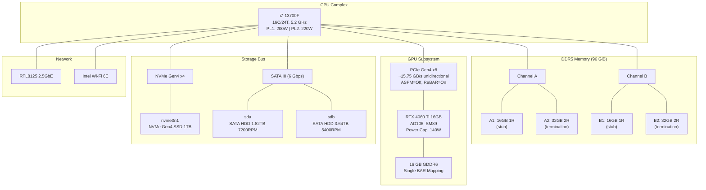

---

## 3. Storage Architecture

### 3.1 Volume Group Topology

Storage is divided into three active Volume Groups — one per SATA drive and one on NVMe (`vg_gateway`, created in Phase 8). `vg_sys` (replacing root with proper LVM) remains future. No cross-drive spanning.

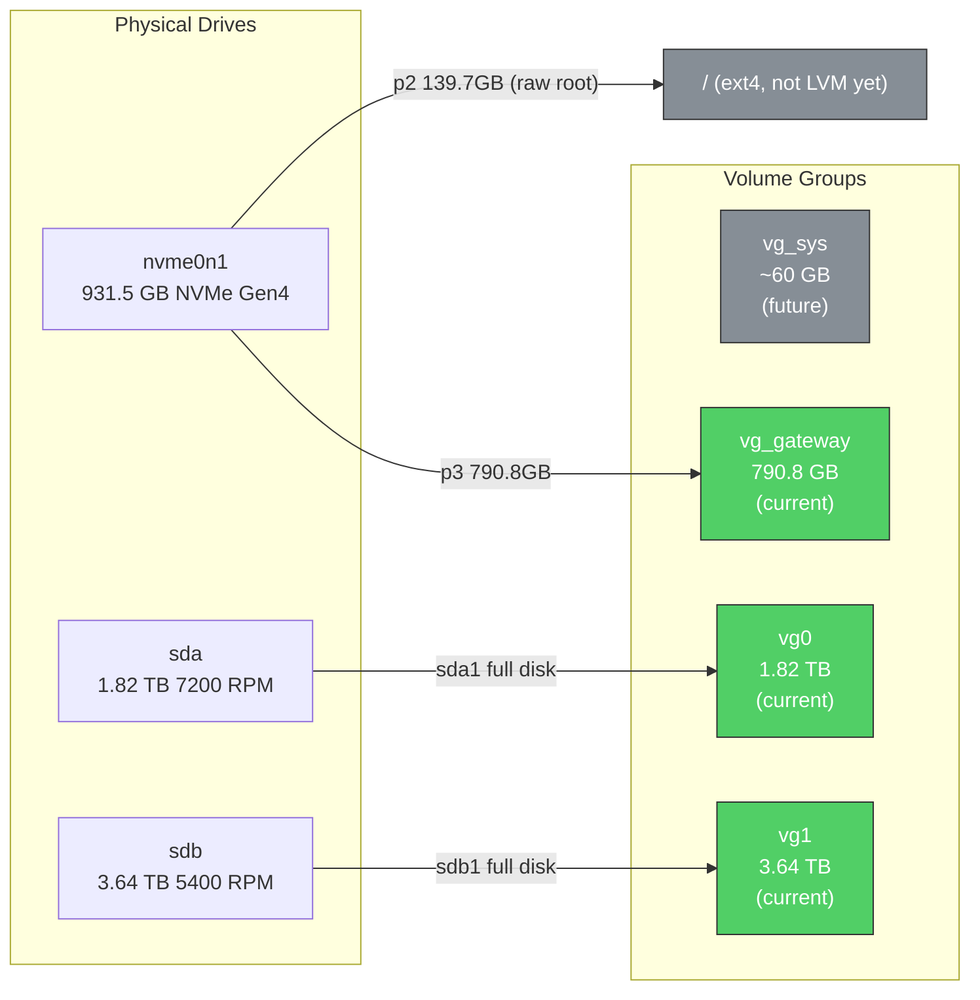

| Volume Group | Physical Source | Capacity | Speed Tier | Status | Role |
|---|---|---|---|---|---|
| `vg0` | `/dev/sda1` | 1.82 TB | 7200 RPM | **Current** | Development, projects, user files |
| `vg1` | `/dev/sdb1` | 3.64 TB | 5400 RPM | **Current** | Media, ML models, VMs, staging |
| `vg_gateway` | `/dev/nvme0n1p3` | 790.8 GB | NVMe Gen4 | **Current** | Active runtime, identity, swap |
| `vg_sys` | `/dev/nvme0n1p2` | ~60 GB | NVMe Gen4 | Future | Disposable OS root (requires OS reinstall) |

### 3.2 Logical Volumes — vg0 (sda, 7200 RPM)

| Logical Volume | Size | Mount Point | Label | Purpose | Notes |
|---|---|---|---|---|---|
| `lv_core` | 1.75 TB | `/home/core` | Core | Development, projects, docs | Primary workspace |
| `lv_files` | 45 GB | `/home/core/files` | Files | User documents | Nested mount inside lv_core |

VG fully allocated — 0 free.

### 3.3 Logical Volumes — vg1 (sdb, 5400 RPM)

| Logical Volume | Size | Mount Point | Label | Purpose | Notes |
|---|---|---|---|---|---|
| `lv_media` | 1.5 TB | `/home/media` | Media | Pictures, music, videos, archive | — |
| `lv_models` | 1 TB | `/home/apps/models` | Models | All ML models (Ollama, HF, GGUF, TRT engines) | Single source of truth for ML |
| `lv_vms` | 500 GB | `/home/apps/vms` | VMs | VM disk images | — |
| `lv_staging` | 500 GB | `/home/staging` | Staging | Dedup workspace, misc temp | — |

~166 GB free for future growth.

### 3.4 ML Model Storage

`/home/apps/models/` is the single source of truth for all ML assets:

| Subdirectory | Purpose | Env Var |
|---|---|---|
| `ollama/` | Ollama model storage | `OLLAMA_MODELS` |
| `huggingface/` | Hugging Face cache | `HF_HOME` |
| `engines/` | TRT-LLM compiled engines (SM89) | — |
| `models/` | Loose model files (GGUF, safetensors) | — |

### 3.5 Logical Volumes — vg_gateway (NVMe Gen4, IMPLEMENTED)

`vg_gateway` was created on `nvme0n1p3` (790.8 GB) during Phase 8 (2026-03-17).

| Logical Volume | Size | Mount Point | Label | Purpose | Notes |
|---|---|---|---|---|---|
| `lv_swap` | 32 GB | `[swap]` | Swap | NVMe swap backing for L3 fabric | — |
| `lv_configs` | 50 GB | `/home/active/configs` | Configs | KDE settings, app configs, dotfiles | 60% used |
| `lv_apps_state` | 100 GB | `/home/active/apps` | Apps | Docker data-root, browser profiles, cache | 21% used |
| `lv_inference` | 300 GB | `/home/active/inference` | Inference | Hot model staging, TRT engines | Empty |
| `lv_temp` | 50 GB | `/home/active/temp` | Temp | Downloads, pnpm store | 13% used |
| *(free)* | ~259 GB | — | — | Future expansion | — |

### 3.5.1 Logical Volumes — vg_sys (Future — NVMe Restructuring)

`vg_sys` will replace the current raw ext4 root partition with a proper LVM root. This requires an OS reinstall and is deferred.

| Logical Volume | Size | Mount Point | Purpose |
|---|---|---|---|
| `lv_root` | ~55 GB | `/` | Disposable OS — can be wiped for upgrades |

### 3.6 NVMe Current Layout

| Partition | Size | Filesystem | Mount | Label | Usage | Notes |
|---|---|---|---|---|---|---|
| `nvme0n1p1` | 1 GB | FAT32 (EFI) | `/boot/efi` | — | Boot | Unchanged |
| `nvme0n1p2` | 139.7 GB | ext4 | `/` | System | OS root | ~73% used |
| `nvme0n1p3` | 790.8 GB | LVM (`vg_gateway`) | *(5 LVs)* | — | Active runtime | See Section 3.5 |

**vg_gateway LVs on nvme0n1p3:**

| Logical Volume | Size | Mount | Label | Usage |
|---|---|---|---|---|
| `lv_swap` | 32 GB | `[swap]` | Swap | NVMe swap |
| `lv_configs` | 50 GB | `/home/active/configs` | Configs | 60% used |
| `lv_apps_state` | 100 GB | `/home/active/apps` | Apps | 21% used |
| `lv_inference` | 300 GB | `/home/active/inference` | Inference | Empty |
| `lv_temp` | 50 GB | `/home/active/temp` | Temp | 13% used |
| *(free)* | ~259 GB | — | — | Future expansion |

### 3.7 NVMe Target Layout (Remaining — vg_sys Only)

The `vg_gateway` partition is now live on `nvme0n1p3`. The remaining future work is replacing the raw ext4 root (`nvme0n1p2`) with a proper LVM root (`vg_sys`), which requires an OS reinstall.

| Partition | Size | Type | Content | Status |
|---|---|---|---|---|
| `nvme0n1p1` | 1 GB | FAT32 (EFI) | Boot | **Current** |
| `nvme0n1p2` | 139.7 GB | ext4 (raw) | OS root (73% used) | **Current** — future: LVM `vg_sys` ~60 GB |
| `nvme0n1p3` | 790.8 GB | LVM (`vg_gateway`) | 5 LVs + ~259 GB free | **Current** |

### 3.8 Filesystem Labels

| Label | Device | Mount Point |
|---|---|---|
| System | nvme0n1p2 | `/` |
| Swap | vg_gateway/lv_swap | `[swap]` |
| Configs | vg_gateway/lv_configs | `/home/active/configs` |
| Apps | vg_gateway/lv_apps_state | `/home/active/apps` |
| Inference | vg_gateway/lv_inference | `/home/active/inference` |
| Temp | vg_gateway/lv_temp | `/home/active/temp` |
| Core | vg0/lv_core | `/home/core` |
| Files | vg0/lv_files | `/home/core/files` |
| Media | vg1/lv_media | `/home/media` |
| Models | vg1/lv_models | `/home/apps/models` |
| VMs | vg1/lv_vms | `/home/apps/vms` |
| Staging | vg1/lv_staging | `/home/staging` |

---

## 4. Directory Structure

### 4.1 Mount Points

```
/                          <- nvme0n1p2 (root, disposable)
/boot/efi                  <- nvme0n1p1 (EFI)
/home/active/configs       <- vg_gateway/lv_configs (50 GB, NVMe Gen4)
/home/active/apps          <- vg_gateway/lv_apps_state (100 GB, NVMe Gen4)
/home/active/inference     <- vg_gateway/lv_inference (300 GB, NVMe Gen4)
/home/active/temp          <- vg_gateway/lv_temp (50 GB, NVMe Gen4)
/home/core                 <- vg0/lv_core (1.75 TB, 7200 RPM)
/home/core/files           <- vg0/lv_files (45 GB, 7200 RPM)
/home/media                <- vg1/lv_media (1.5 TB, 5400 RPM)
/home/apps/models          <- vg1/lv_models (1 TB, 5400 RPM)
/home/apps/vms             <- vg1/lv_vms (500 GB, 5400 RPM)
/home/staging              <- vg1/lv_staging (500 GB, 5400 RPM)
```

### 4.2 Directory Tree

```
/home/core/                            <- vg0/lv_core (1.75 TB, 7200 RPM)
├── dev/                               active development
│   ├── prod/                          production projects
│   ├── lab/                           experiments
│   ├── glare/                         glare project
│   ├── glare-reorg/                   glare reorganization
│   ├── archive/                       old projects
│   └── staging/                       dev staging area
├── infra/                             infrastructure
│   └── k3s-lan/                       k3s cluster ops
├── projects/                          project documentation
│   └── project-host/                  this project
├── startup-team/                      agent team infrastructure
├── scripts/                           utility scripts
├── icecrown/                          icecrown business resources
├── vierla/                            vierla project (archived)
├── docs/                              obsidian vault, documents, lists
├── library/                           reference material
│   ├── books/
│   ├── ML papers/
│   ├── SWE/
│   └── physics/
├── gen/                               NVIDIA generative tools
│   ├── Falcor/
│   ├── kaolin/
│   └── 3D/
├── util/                              third-party tools/repos
├── attic/                             cold storage, old configs
├── Desktop/                           unsorted staging
├── moving/                            TEMPORARY — data being triaged
└── media/dc5-staging/                 TEMPORARY — legacy data being triaged

/home/core/files/                      <- vg0/lv_files (45 GB, 7200 RPM)
├── documents/
├── professional/
├── legal/
└── ...

/home/apps/models/                     <- vg1/lv_models (1 TB, 5400 RPM)
├── ollama/                            Ollama model storage (OLLAMA_MODELS)
├── huggingface/                       HF cache (HF_HOME)
├── engines/                           TRT-LLM compiled engines (SM89)
└── models/                            loose model files (GGUF, safetensors)

/home/apps/vms/                        <- vg1/lv_vms (500 GB, 5400 RPM)
└── (VM disk images)

/home/media/                           <- vg1/lv_media (1.5 TB, 5400 RPM)
└── (pictures, music, videos, archive)

/home/staging/                         <- vg1/lv_staging (500 GB, 5400 RPM)
└── (dedup workspace, misc temp)

/home/active/                          <- vg_gateway LVs (NVMe Gen4)
├── configs/                           KDE, app configs, dotfiles (lv_configs)
├── apps/                              Docker data-root, browser profiles, cache (lv_apps_state)
│   ├── cache/                         ~/.cache contents
│   ├── claude-vms/                    Claude Desktop VM bundles
│   └── docker-data/                   Docker data-root
├── inference/                         Hot model staging, TRT engines (lv_inference)
└── temp/                              Downloads, pnpm store (lv_temp)
    ├── downloads/
    └── .pnpm-store/
```

### 4.3 Home Symlinks

Only four symlinks exist in `~/`:

| Symlink | Target | Purpose |
|---|---|---|
| `~/development` | `/home/core/development` | Active code projects |
| `~/documents` | `/home/core/documents` | Obsidian vault, documentation |
| `~/files` | `/home/core/files` | User files (lv_files) |
| `~/Downloads` | `/home/active/temp/downloads` | Fast NVMe downloads |

That is the complete set. No other symlinks or bind mounts in the home directory.

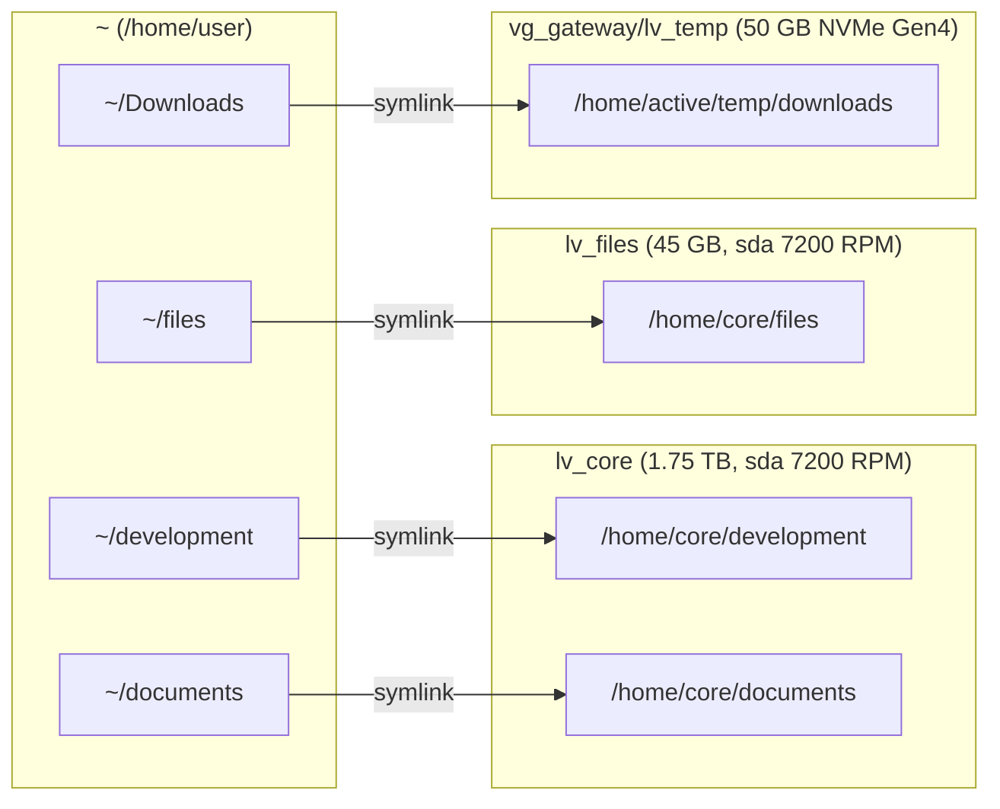

### 4.4 Full Directory Topology

```mermaid
graph TD
    subgraph NVMe ["nvme0n1 (931.5 GB NVMe Gen4)"]
        ROOT["/ (nvme0n1p2, 139.7 GB)<br>System — Disposable OS"]
        EFI["/boot/efi (p1, 1 GB)"]

        subgraph VG_GW ["vg_gateway (p3, 790.8 GB)"]
            LV_SWAP["lv_swap (32 GB)<br>[swap]"]
            LV_CONFIGS["/home/active/configs<br>lv_configs (50 GB)"]
            LV_APPS["/home/active/apps<br>lv_apps_state (100 GB)"]
            LV_APPS_DOCKER["/home/active/apps/docker-data"]
            LV_INFERENCE["/home/active/inference<br>lv_inference (300 GB)"]
            LV_TEMP["/home/active/temp<br>lv_temp (50 GB)"]
            LV_TEMP_DL["/home/active/temp/downloads"]
            LV_APPS --- LV_APPS_DOCKER
            LV_TEMP --- LV_TEMP_DL
        end
    end

    subgraph SDA ["sda (1.82 TB 7200 RPM)"]
        subgraph VG0 ["vg0 (fully allocated)"]
            CORE["/home/core (lv_core 1.75 TB)"]
            CORE_DEV["/home/core/dev/"]
            CORE_INFRA["/home/core/infra/"]
            CORE_PROJECTS["/home/core/projects/"]
            CORE_DOCS["/home/core/docs/"]
            CORE --- CORE_DEV & CORE_INFRA & CORE_PROJECTS & CORE_DOCS

            FILES_LV["/home/core/files (lv_files 45 GB)"]
            FILES_LV --- FILES_DOC["documents/"] & FILES_PROF["professional/"] & FILES_LEGAL["legal/"]
        end
    end

    subgraph SDB ["sdb (3.64 TB 5400 RPM)"]
        subgraph VG1 ["vg1 (~166 GB free)"]
            MEDIA["/home/media (lv_media 1.5 TB)"]
            MODELS["/home/apps/models (lv_models 1 TB)"]
            MODELS_OLL["ollama/"]
            MODELS_HF["huggingface/"]
            MODELS_ENG["engines/"]
            MODELS_LOOSE["models/"]
            MODELS --- MODELS_OLL & MODELS_HF & MODELS_ENG & MODELS_LOOSE
            VMS["/home/apps/vms (lv_vms 500 GB)"]
            STAGING["/home/staging (lv_staging 500 GB)"]
        end
    end

    subgraph User_Home ["/home/user (symlink hub)"]
        HL_DEV["~/development ->"]
        HL_DOCS["~/documents ->"]
        HL_FILES["~/files ->"]
        HL_DL["~/Downloads ->"]
    end

    HL_DEV -.-> CORE_DEV
    HL_DOCS -.-> CORE_DOCS
    HL_FILES -.-> FILES_LV
    HL_DL -.-> LV_TEMP_DL
```

---

## 5. Inference Memory Architecture

This section describes the complete memory hierarchy and inference optimization strategy for running large language models on consumer hardware. The system treats VRAM, DDR5 RAM, compressed swap, and NVMe as a unified tiered fabric — each tier with dramatically different bandwidth and latency characteristics.

### 5.1 Hardware Bandwidth Reality

Four memory tiers exist between the GPU and permanent storage, with order-of-magnitude bandwidth gaps between each:

| Tier | Component | Bandwidth | Capacity |
|---|---|---|---|
| **T0** | VRAM (GDDR6) | 288 GB/s | 16 GB |
| **T1** | DDR5-5200 (dual channel) | ~83 GB/s | 96 GB |
| **T2** | NVMe Gen4 x4 | ~3.6 GB/s | 790.8 GB (vg_gateway) |
| **T3** | HDD 5400 RPM (sdb) | ~0.1 GB/s | 1 TB (lv_models) |

The PCIe x8 Gen4 bridge between GPU and system RAM is ~15.75 GB/s unidirectional — the critical bottleneck for weight streaming.

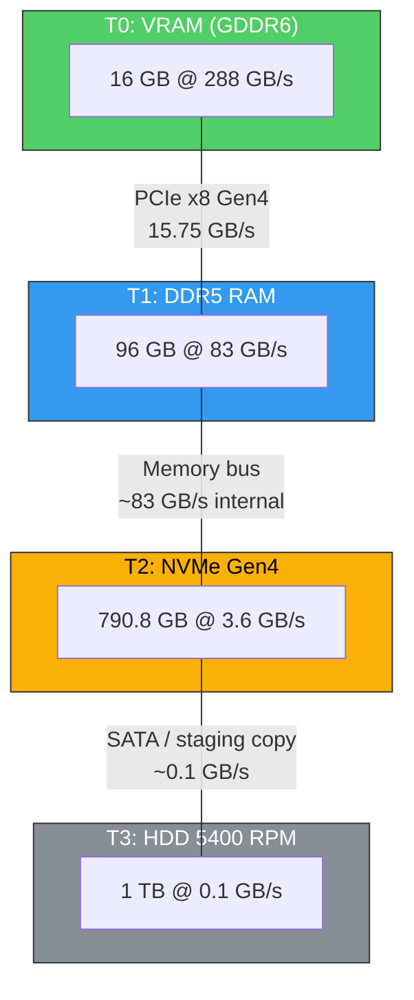

**Key insight:** The bandwidth drops 3.5x from VRAM to RAM, then 23x from RAM to NVMe, then 36x from NVMe to HDD. Every tier boundary is a cliff. Inference performance is dominated by which tier holds the hot data.

### 5.2 Token Generation Cycle

For each token generated, data flows through multiple tiers. The critical path determines tokens-per-second:

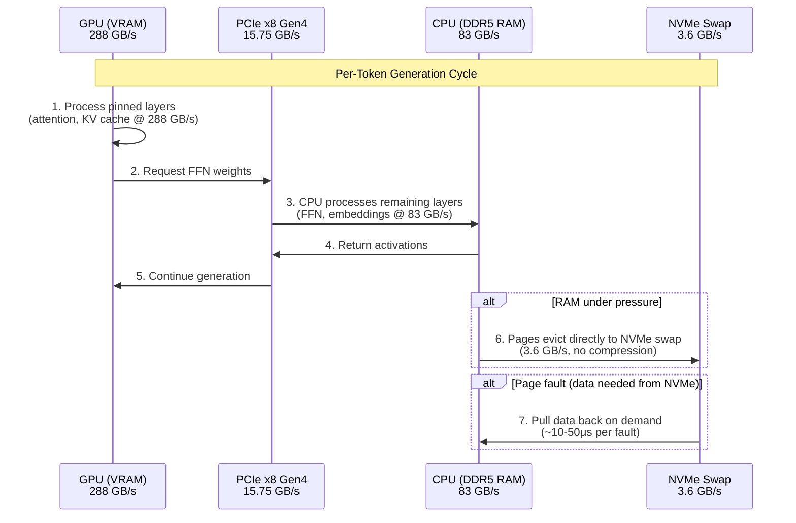

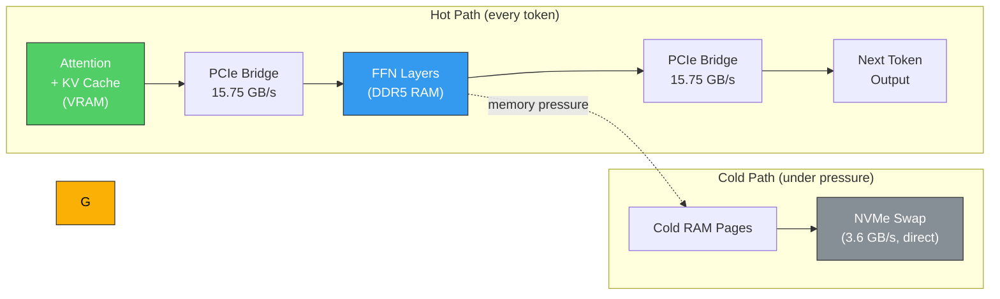

### 5.3 Layer Placement Strategy

Not all model layers are equal. Attention layers are accessed every token and benefit most from VRAM bandwidth. FFN layers are larger but accessed less critically. The optimal split depends on model size:

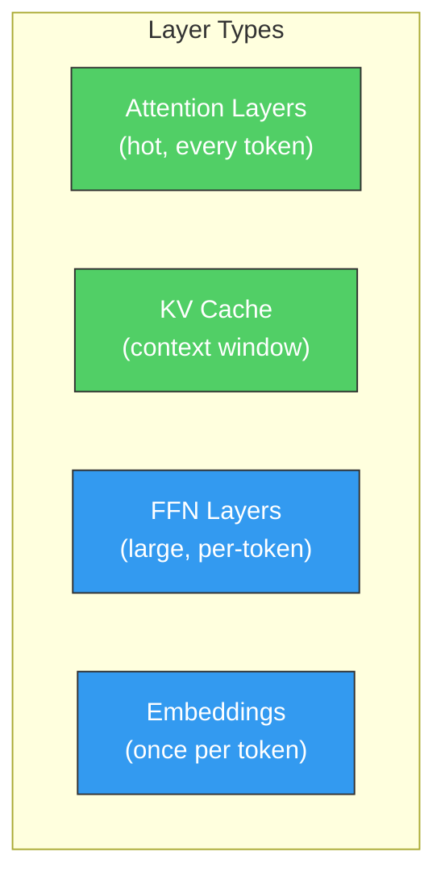

| Model | Total Size | GPU Layers | RAM Layers | Split | Notes |
|---|---|---|---|---|---|
| **7B-13B** | 4-8 GB (Q4) | All | None | 100% GPU | Fits entirely in VRAM |
| **34B Q4** | ~20 GB | 28 of 48 | 20 of 48 | ~58% GPU | Attention + KV in VRAM, FFN overflow to RAM |
| **70B Q4** | ~40 GB | 30 of 80 | 50 of 80 | ~37% GPU | Most FFN layers in RAM |
| **70B Q8** | ~80 GB | 14 of 80 | 66 of 80 | ~18% GPU | Heavy RAM dependency, PCIe-bound |
| **120B+ Q4** | 60+ GB | ~14 | ~66+ | GPU + RAM + NVMe | mmap overflow to NVMe swap |

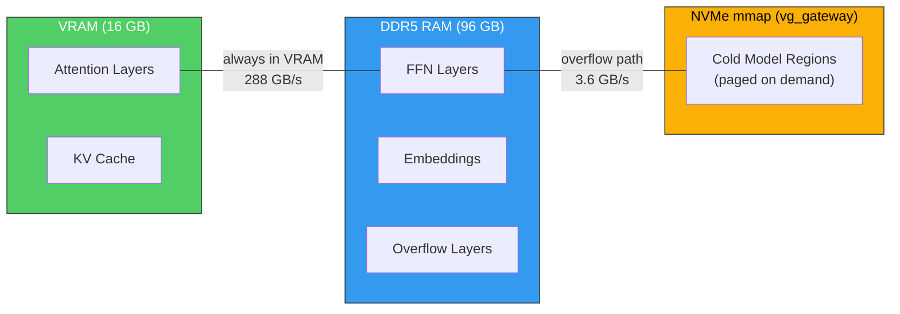

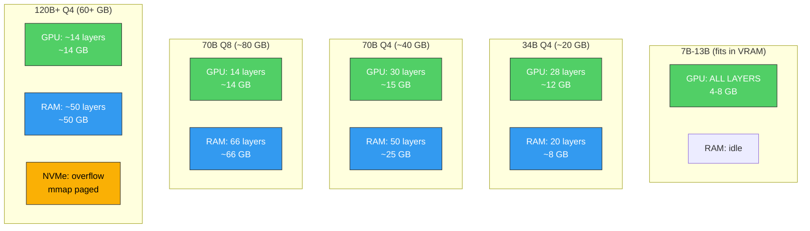

### 5.4 The Full Memory Hierarchy

The complete addressable memory stack from GPU to cold storage:

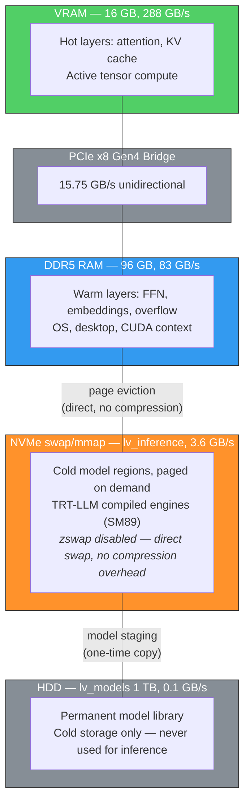

**Addressable capacity summary:**

| Scope | Capacity | Latency Class |
|---|---|---|
| **Practical fast inference** (VRAM + RAM) | 112 GB | Microseconds |
| **With NVMe overflow** (+ mmap/swap) | ~300 GB | Milliseconds (page faults) |
| **Total addressable** (+ HDD staging) | ~1 TB | Seconds (one-time staging only) |

### 5.5 Model Loading Workflow

Models are stored permanently on HDD and staged to NVMe for inference. This two-step process keeps the slow HDD out of the inference hot path:

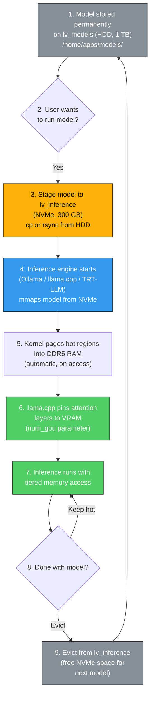

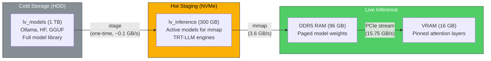

### 5.6 NVIDIA CUDA Unified Virtual Memory (UVM)

The RTX 4060 Ti supports CUDA Unified Virtual Memory, which allows GPU kernels to address more than the physical 16 GB VRAM by transparently paging between VRAM and system RAM. However, on consumer hardware this comes with significant caveats:

- **Limited UVM capability** compared to datacenter GPUs (A100, H100) — consumer drivers have restricted oversubscription support
- **Page faults add 10-50 us latency per fault** — each fault stalls the GPU warp until data arrives over PCIe
- **Excessive oversubscription causes thrashing** — GPU utilization collapses as warps stall waiting for page migrations
- **True unified memory requires NVLink-C2C** — Grace Hopper achieves 900 GB/s coherent access between CPU and GPU memory pools
- **On this system, PCIe at 15.75 GB/s is the practical bridge** — explicit layer placement (num_gpu) outperforms UVM for inference

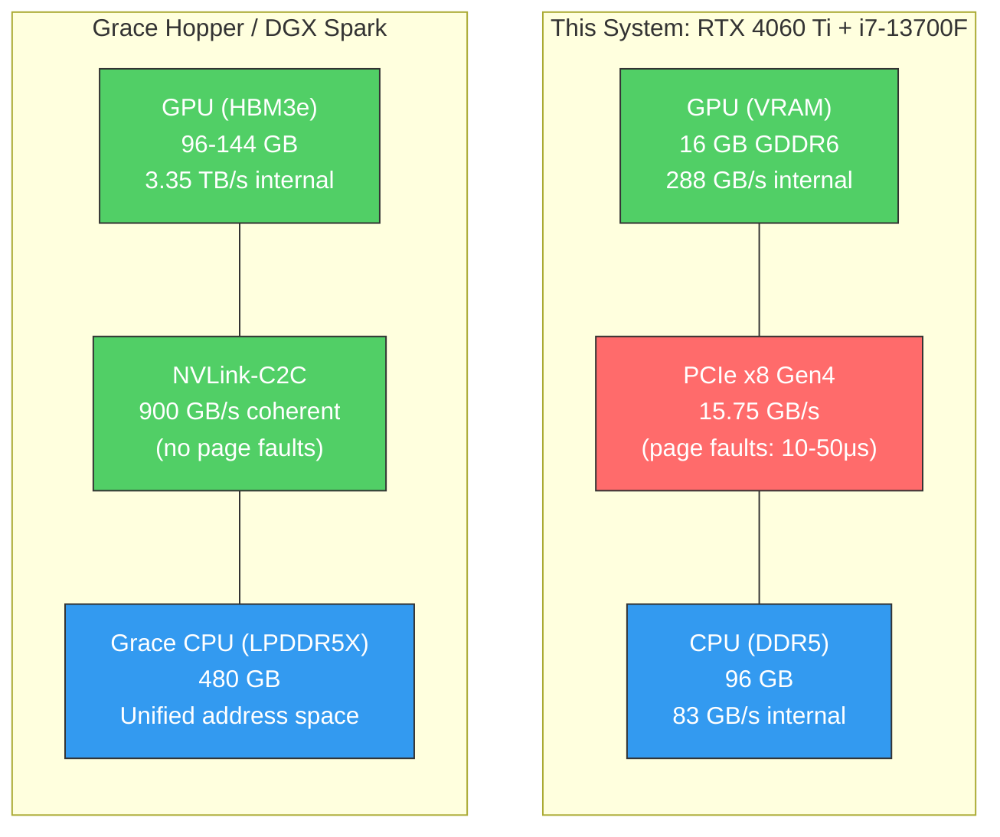

**Why explicit tiering beats UVM on this hardware:** Grace Hopper's 900 GB/s NVLink-C2C makes UVM transparent — the GPU can touch CPU memory almost as fast as its own. On this system, the 15.75 GB/s PCIe link is 57x slower than that. Explicit layer placement via `num_gpu` (llama.cpp) or engine compilation (TRT-LLM) ensures hot layers stay in VRAM and cold layers are served from RAM at CPU speed — avoiding the latency penalty of GPU-initiated page faults.

**GPU UVM cache_sysmem optimization:** The `uvm_exp_gpu_cache_sysmem=1` module option (configured in `/etc/modprobe.d/nvidia-uvm-optimized.conf`) allows the GPU L2 cache to cache system RAM pages. When model layers spill from VRAM to system RAM, this avoids a full PCIe round-trip for repeated access to the same host memory pages. Combined with `uvm_perf_prefetch_threshold=75` and `uvm_perf_prefetch_min_faults=1`, this creates an aggressive prefetch pipeline optimized for sequential LLM weight streaming. See the [GPU Direct Memory reference](../docs/reference/gpu-direct-memory.md) for full configuration.

### 5.7 Inference Engine Priority

Choosing the right engine depends on model availability, performance requirements, and operational complexity:

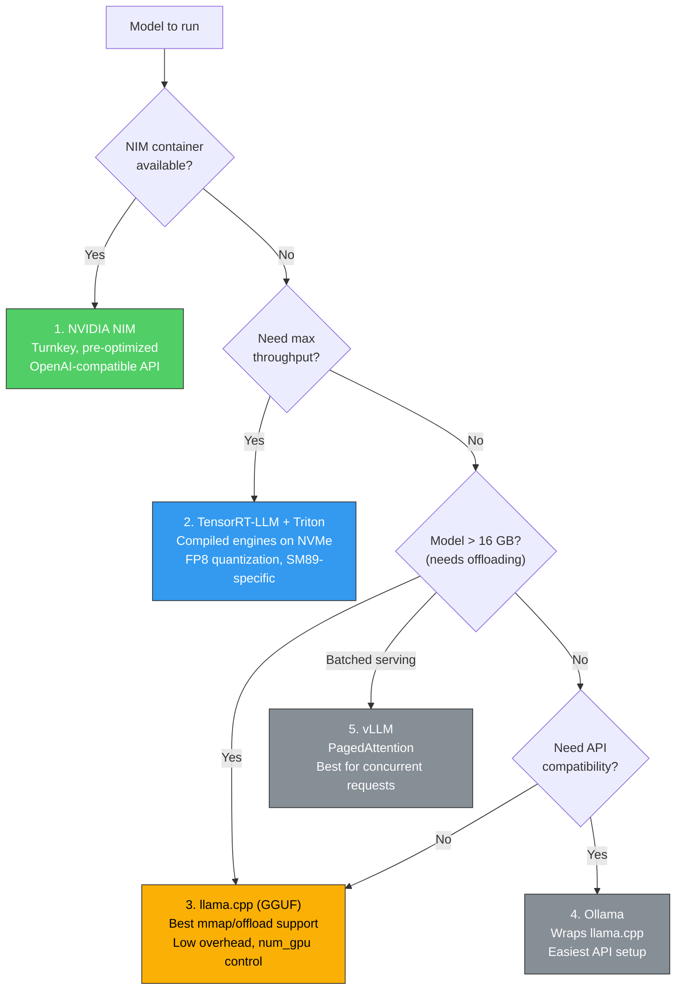

| Priority | Engine | Strengths | Best For |
|---|---|---|---|
| 1 | **NVIDIA NIM** | Turnkey, pre-optimized, OpenAI API | Production deployment when container exists |
| 2 | **TensorRT-LLM + Triton** | Max throughput, FP8, compiled engines | Performance-critical, compiled on NVMe |
| 3 | **llama.cpp** | GGUF format, low overhead, mmap | Oversubscribed models, rapid testing |
| 4 | **Ollama** | Easiest setup, wraps llama.cpp | Quick prototyping, API access |
| 5 | **vLLM** | PagedAttention, batched serving | Multi-user / concurrent request serving |

### 5.8 NVMe Inference Partition (IMPLEMENTED)

`lv_inference` (300 GB on `vg_gateway`) is live at `/home/active/inference` with ~280 GB free. It acts as the hot model staging area — bridging the gap between cold HDD storage and live RAM:

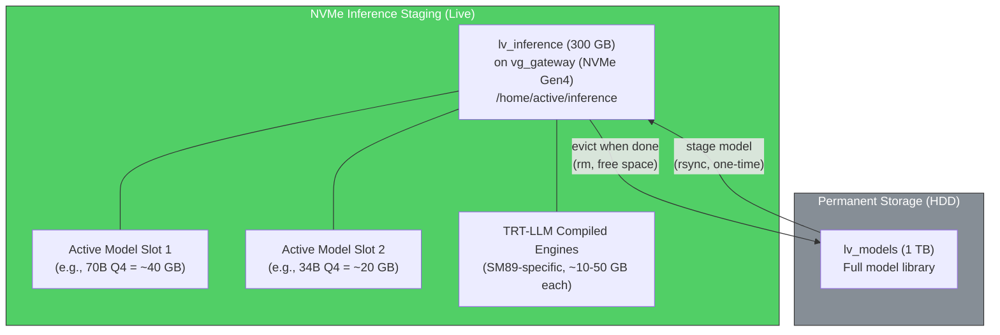

- **3.6 GB/s mmap reads** vs 0.1 GB/s from HDD — 36x faster page-in during inference
- **TRT-LLM compiled engines** are SM89-specific and take significant time to build; stored on NVMe for instant reuse
- **Room for 2 large models simultaneously** (e.g., 70B Q4 + 34B Q4 = ~60 GB, plus engines)
- **Workflow:** permanent storage on `lv_models` --> stage to `lv_inference` --> run --> evict

### 5.9 Optimization Stack

Kernel and runtime tuning that supports the inference memory hierarchy:

**zswap:** Disabled (`zswap.enabled=0` in GRUB). CPU cycles are reserved for inference workloads, not swap compression. Cold anonymous pages go directly to NVMe swap.

**HugePages:** 4096 x 2MB = 8 GB statically reserved (`vm.nr_hugepages=4096`). Used by GPU driver pinned buffers and large model allocations.

**Transparent Huge Pages (THP):**
- Mode: `madvise` — inference engines opt-in via `madvise(MADV_HUGEPAGE)` on tensor allocations
- Desktop apps and Electron processes are not forced into hugepages (avoids compaction stalls)

**GPU Power Management:**
- 140W power cap via `nvidia-powerlimit.service` (overrides older 150W `nvidia-powercap.service`)
- Clock lock removed (was 2535 MHz) — 140W power cap governs thermal/clock behavior; card boosts to 2610+ MHz (see 5.11)
- Persistence mode eliminates 200-300ms cold-start latency

**Ollama Runtime:**
- `OLLAMA_KEEP_ALIVE=24h` — keeps models hot in RAM for 24 hours after last request (see 5.11 for full tuning)
- `OLLAMA_FLASH_ATTENTION=1` — enables flash attention kernels for faster attention computation

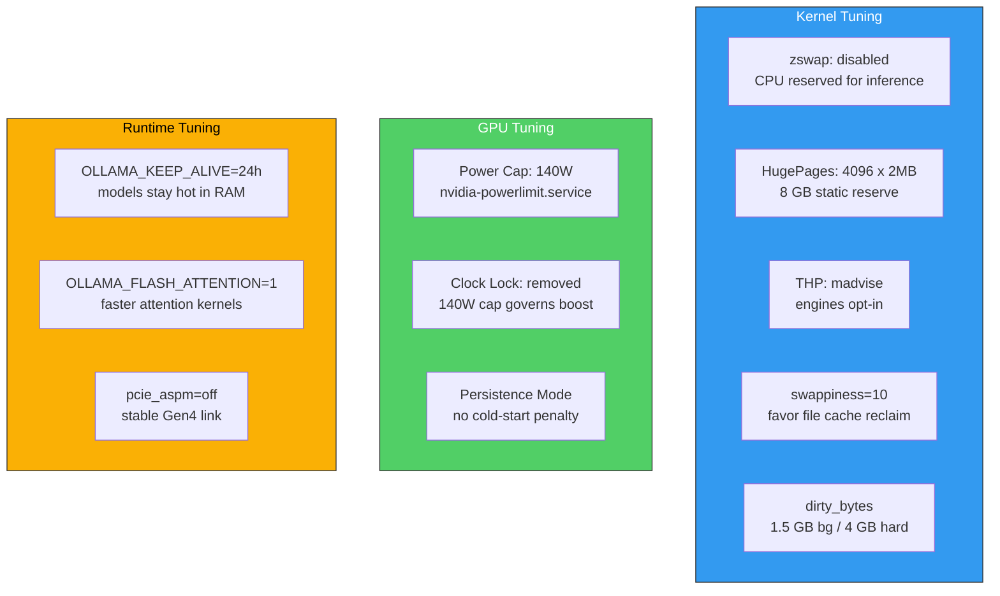

### 5.10 Environment Variables

```bash
# ML model storage — permanent library (on lv_models, HDD)
export HF_HOME=/home/apps/models/huggingface
export OLLAMA_MODELS=/home/apps/models/ollama

# Hot inference staging (on lv_inference, NVMe — live since Phase 8)
export INFERENCE_STAGING=/home/active/inference
```

### 5.11 Benchmark Results (2026-03-17)

Benchmark data is currently being collected and validated. Full results will be published in the [Inference Benchmarks](docs/guides/inference-benchmarks.md) guide once the validation suite is complete.

#### 5.11.1 Optimizations Applied

**GPU clock lock removed** — was locked at 2535 MHz (see 5.9), max boost is 3105 MHz. The 140W power cap (via `nvidia-powerlimit.service`) acts as natural thermal governor. Card now boosts to 2610+ MHz during inference.

**Ollama runtime tuning** (systemd override + environment):

| Parameter | Value | Effect |
|---|---|---|
| `OLLAMA_KEEP_ALIVE` | `24h` | Models stay hot in RAM between sessions |
| `OLLAMA_MAX_LOADED_MODELS` | `2` | Two models resident simultaneously |
| `OLLAMA_NUM_PARALLEL` | `4` | Parallel request handling per model |
| `OLLAMA_FLASH_ATTENTION` | `1` | Flash attention kernels confirmed active |
| `LimitMEMLOCK` | `infinity` | Prevents swap of pinned GPU/inference pages |
| `LimitNOFILE` | `65536` | Avoids fd exhaustion under parallel load |

**THP persistence** — dedicated systemd service ensures `madvise` mode survives reboots. Previous GRUB param was being overridden to `always` by an unknown init path.

**Inference sysctls** (applied at boot via `/etc/sysctl.d/`):

| Sysctl | Value | Rationale |
|---|---|---|
| `vm.compaction_proactiveness` | `0` | Eliminates background compaction stalls during inference |
| `kernel.numa_balancing` | `0` | Prevents page migration overhead on single-socket system |

**App config offload** — Chrome (11 GB), VS Code (9.1 GB), Antigravity (2.3 GB), Discord, Slack, and `~/.local/share` moved to `lv_apps_state` via symlinks. Root partition usage dropped from 73% to 50%.

#### 5.11.2 Key Architectural Insights

**Layer Split Impact:** For models that overflow VRAM, the optimal strategy is to maximize GPU layers up to ~15.5 GB VRAM — leaving ~0.5 GB headroom for KV cache and CUDA overhead. Additional layers beyond VRAM capacity stream from DDR5 at 83 GB/s (memory bus) but are gated by the 15.75 GB/s PCIe bridge.

**PCIe Bottleneck:** Generation speed for oversubscribed models is dominated by PCIe weight streaming — the bottleneck described in Section 5.2. Tensor cores are fully utilized for layers that fit in VRAM; the limiting factor is data delivery, not compute.

**Ollama auto‑split behavior:** Ollama's automatic `num_gpu` selection on Linux is conservative — for models that overflow VRAM, it tends to under‑allocate GPU layers. For maximum performance, manually specify `num_gpu` in the API call or create a Modelfile with the optimal value for each model size.

#### 5.11.3 Recommended `num_gpu` Values

Target hardware: RTX 4060 Ti 16GB, PCIe x8 Gen4, 96 GB DDR5‑5200.

| Model Size | Quant | Weight Size | Fits VRAM? | Recommended `num_gpu` | Expected VRAM |
|---|---|---|---|---|---|
| 1‑3B | Q4_K_M | 1‑2 GB | Yes | `99` (all) | 2‑4 GB |
| 7‑9B | Q4_K_M | 4‑6 GB | Yes | `99` (all) | 6‑9 GB |
| 14B | Q4_K_M | 8‑9 GB | Yes | `99` (all) | 10‑13 GB |
| 22‑27B | Q4_K_M | 13‑16 GB | Marginal | `99` (all) | 14‑16 GB |
| 32B | Q4_K_M | 20 GB | No | `40` | 15.5 GB |
| 70B | Q4_K_M | 40 GB | No | `24` | 15.5 GB |

**Rule of thumb:** Set `num_gpu` to the highest value that keeps VRAM at or below 15.5 GB. Use `ollama ps` or `nvidia‑smi` to verify. For models that fit entirely in VRAM, set `num_gpu=99` to force full GPU offload.

---

## 6. BIOS Configuration

All settings entered manually via UEFI BIOS. Press `Delete` at boot, then `F7` for Advanced Mode.

### 6.1 CPU & Power

**`OC > Advanced CPU Configuration`:**

| Setting | Value | Rationale |
|---|---|---|
| P-Core Ratio Apply Mode | All Core | Consistent all-core clocks for inference |
| Long Duration Power Limit (PL1) | 200W | VRM thermal ceiling for sustained load |
| Short Duration Power Limit (PL2) | 220W | Burst headroom for model layer loading |
| CPU Current Limit (IccMax) | 307A | Prevents premature OCP trips during matrix ops |
| CPU Lite Load | Mode 9 | Lowers loadline voltage, reduces VRM heat |
| IA CEP Support | Disabled | Prevents phantom clock stretching under Mode 9 undervolt |

### 6.2 Memory

**`OC` and `OC > Advanced DRAM Configuration`:**

**Do not use XMP or Memory Try It.** Manual configuration only.

| Setting | Value | Rationale |
|---|---|---|
| DRAM Frequency | 5200 MT/s | Stable; validate with memtest86 |
| Gear Mode | Gear 1 (1:1 ratio) | Lower latency — validate with memtest86 |
| CPU VDDQ & VDD2 | 1.25V | Conservative, protects Micron ICs |
| DRAM VDD & VDDQ | 1.25V | Safe ceiling for mixed-IC modules |
| Command Rate | 2T (2N) | Required for mixed rank-per-channel load |
| Primary Timings (tCL-tRCD-tRP-tRAS) | 40-40-40-84 | Loosened for stability with mixed ICs |

**Production Status:** 5200 MT/s / Gear 1 / CL40 / 1.25V has been validated through months of stable operation under real inference workloads (sustained multi-hour 70B model runs, heavy swap pressure, mixed desktop use). The fallback ladder to 4800 MHz was not needed. 5200 MT/s is the confirmed production setting.

**Fallback Validation Ladder** (reference only — not needed in practice):

If instability (memtest86 errors, kernel panics, or WHEA MCE events) is detected, step down through the following configurations:

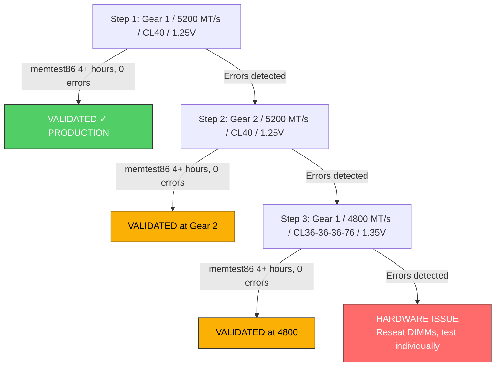

### 6.3 PCIe & Virtualization

**`Settings > Advanced > PCIe/PCI Sub-system Settings`:**

| Setting | Value | Rationale |
|---|---|---|
| PCIe Generation | Gen 4 (forced) | Prevents ASPM-induced fallback to Gen 1 |
| Re-Size BAR Support | Enabled | Single-block 16 GB VRAM mapping |
| Above 4G Memory / Crypto Currency Mining | Enabled | Required for ReBAR |

**`OC > CPU Features`:**

| Setting | Value | Rationale |
|---|---|---|
| Intel VT-x | Enabled | Hardware virtualization for containers |
| Intel VT-d | Enabled | IOMMU for device passthrough |

---

## 7. OS & Kernel Configuration

### 7.1 GRUB

Edit `/etc/default/grub`:

```
GRUB_CMDLINE_LINUX_DEFAULT="quiet splash nvidia-drm.modeset=1 pcie_aspm=off zswap.enabled=0 transparent_hugepage=madvise intel_iommu=on iommu=pt"
```

Apply: `sudo update-grub`

Parameters:
- `nvidia-drm.modeset=1` — required for Wayland (KWin compositor) and GSP firmware
- `pcie_aspm=off` — prevents OS power-state throttling from downgrading PCIe link speed
- `zswap.enabled=0` — disable zswap entirely; CPU cycles reserved for inference, not compression
- `transparent_hugepage=madvise` — inference engines opt-in to hugepages; desktop apps don't waste them
- `intel_iommu=on` — enable Intel IOMMU for device isolation (VT-d)
- `iommu=pt` — IOMMU passthrough mode; zero overhead for bare-metal GPU

### 7.2 CPU Governor

Set to `performance` for sustained inference workloads:

```bash
echo performance | sudo tee /sys/devices/system/cpu/cpu*/cpufreq/scaling_governor
```

Make persistent via `/etc/default/cpufrequtils`:
```
GOVERNOR="performance"
```

Alternative: append `cpufreq.default_governor=performance` to GRUB cmdline.

### 7.3 Kernel Memory

**Transparent Huge Pages:**

Use `madvise` — not `always`, not `never`. Inference engines (vLLM, SGLang, TRT-LLM) use `madvise(MADV_HUGEPAGE)` on tensor allocations and get huge pages where needed. `always` forces hugepages on Electron apps and KDE, causing compaction stalls and memory waste.

Persistent via GRUB cmdline (`transparent_hugepage=madvise`). Verify live:
```bash
cat /sys/kernel/mm/transparent_hugepage/enabled
# Expected: always [madvise] never
```

**Sysctl tuning** (`/etc/sysctl.d/99-sysctl.conf`):
```
vm.swappiness = 10
vm.dirty_background_bytes = 1610612736
vm.dirty_bytes = 4294967296
vm.vfs_cache_pressure = 80
```

Rationale:
- `swappiness=10` — strongly favors reclaiming file cache (cheap for mmap'd model weights) over swapping anonymous memory. Values below 5 cause aggressive page cache reclaim, hurting mmap-based model loading.
- `dirty_*_bytes` — absolute bytes, not ratios. Ratios scale badly at 96 GB (20% = 19.2 GB dirty data before forced writeback). 1.5 GB background / 4 GB hard limit gives predictable behavior.
- `vfs_cache_pressure=80` — slightly favors keeping dentry/inode cache over page cache.
- **Static HugePages** (`vm.nr_hugepages=4096`) — 4096 x 2MB = 8 GB reserved for GPU driver pinned buffers and large model allocations. THP madvise handles additional large-page allocation for inference engines.

### 7.4 NVIDIA Driver Configuration

**Modprobe config** (`/etc/modprobe.d/nvidia.conf`):

```
options nvidia-drm modeset=1
options nvidia-drm fbdev=1
options nvidia NVreg_PreserveVideoMemoryAllocations=1
```

**DO NOT** set `NVreg_EnableGpuFirmware` explicitly. GSP firmware is default-on for Ada Lovelace GPUs on driver 590.x. Setting it explicitly is redundant and creates a maintenance burden.

**Suspend/Resume services** (enable all three):
```bash
sudo systemctl enable nvidia-suspend.service
sudo systemctl enable nvidia-resume.service
sudo systemctl enable nvidia-hibernate.service
```

**Known GSP bugs** on kernel 6.17 + driver 590.48.01:
- Kernel panic on suspend (Xid 79)
- Pageflip timeout on resume
- Xid 62 (GPU fallen off the bus) under heavy memory pressure

**Workaround** if issues occur — add to `/etc/modprobe.d/nvidia.conf`:
```
options nvidia NVreg_EnableGpuFirmware=0
```

This disables GSP and returns GPU management to the host CPU driver. Performance impact is minimal for inference workloads.

---

## 8. L2/L3 Memory Fabric

### 8.1 Concept

The memory hierarchy enables 70B+ parameter model inference on 16 GB VRAM by treating the full memory stack as a tiered fabric:

| Tier | Medium | Capacity | Bandwidth | Role |
|---|---|---|---|---|
| **L1** | VRAM (GDDR6) | 16 GB | 288 GB/s | Active tensor compute |
| **L2** | RAM (DDR5) | 96 GB | ~83 GB/s | Weight staging, KV cache, OS |
| **L3 Static** | NVMe swap | 32 GB (vg_gateway/lv_swap) + 32 GB swapfile | ~5 GB/s | Overflow buffer (zswap disabled — direct swap) |
| **L3 Dynamic** | NVMe swap (swapspace) | Elastic | ~5 GB/s | Emergency expansion (optional) |

### 8.2 zswap (Disabled)

zswap is disabled via GRUB cmdline (`zswap.enabled=0`). While zswap can reduce NVMe write amplification by compressing pages in RAM, it consumes CPU cycles across all cores during swap-out. For LLM inference workloads where CPU is needed for weight processing and layer computation, the compression overhead causes latency spikes. Direct swap to NVMe is faster and more predictable for this workload.

### 8.3 L3 Static (32 GB)

A single NVMe swap LV provides the primary L3 backing store:

| Device | Type | Size | Priority |
|---|---|---|---|
| `/dev/vg_gateway/lv_swap` | LVM LV | 32 GB | -2 (default) |

Configured in `/etc/fstab`. Replaces the previous split setup (14.9 GB partition + 16 GB swapfile).

### 8.4 L3 Dynamic (swapspace daemon)

When RAM + static swap fill during massive inference runs, `swapspace` dynamically creates and destroys temporary swapfiles on NVMe:

```bash
sudo apt install swapspace
sudo mkdir -p /home/active/temp/swap-dynamic
```

`/etc/swapspace.conf`:
```
swappath="/home/active/temp/swap-dynamic"
min_swapsize=4294967296
```

```bash
sudo systemctl enable --now swapspace
```

### 8.5 Data Flow

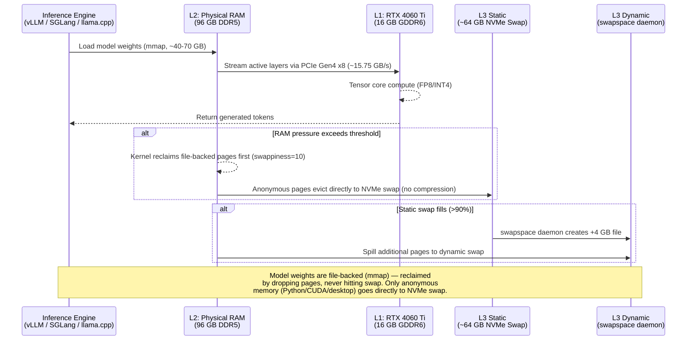

---

## 9. GPU & Inference Stack

### 9.1 nvidia-powercap Service

`/etc/systemd/system/nvidia-powercap.service`:

```ini
[Unit]
Description=NVIDIA Persistence Mode, Power Cap, and Clock Lock
After=nvidia-persistenced.service
Requires=nvidia-persistenced.service

[Service]
Type=oneshot
ExecStart=/usr/bin/nvidia-smi -pm ENABLED
ExecStart=/usr/bin/nvidia-smi -pl 150
ExecStart=/usr/bin/nvidia-smi -lgc 2535
RemainAfterExit=yes
ExecStop=/usr/bin/nvidia-smi -rgc

[Install]
WantedBy=multi-user.target
```

- **Persistence mode** prevents driver unload on idle (eliminates 200-300ms cold-start latency)
- **150W power cap** in this older service is superseded by `nvidia-powerlimit.service` which sets 140W
- **2535 MHz clock lock** has been removed — the 140W power cap acts as natural thermal governor; card boosts to 2610+ MHz

> **Note:** The active power limit is 140W, set by `nvidia-powerlimit.service` which runs after this service.

### 9.2 Inference Priority

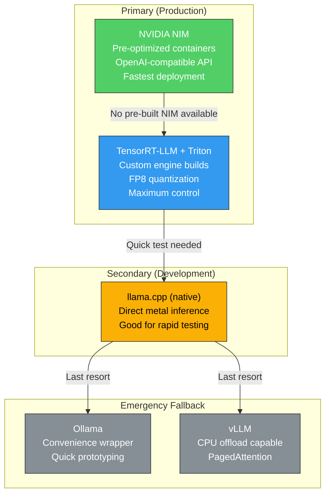

### 9.3 Quantization on Ada Lovelace (SM89)

| Format | Ada Native? | Throughput vs FP16 | Notes |
|---|---|---|---|
| **FP8 (E4M3)** | Yes — native tensor core support | ~2x | Sweet spot for Ada. No dequant overhead. |
| **INT8** | Yes | ~1.8x | Slightly lower quality than FP8 |
| **INT4 / AWQ** | Partial (dequant to FP16) | ~1.5x | Dequantization overhead on tensor cores |

**FP8 is the preferred quantization format** for this hardware. It leverages Ada's native FP8 tensor core paths without the dequantization overhead of INT4/AWQ.

### 9.4 VRAM Budget (RTX 4060 Ti 16 GB)

| Component | FP8 (8-bit) | INT4 (4-bit) |
|---|---|---|
| Model weights (7B params) | ~7 GB | ~3.5 GB |
| CUDA context + driver overhead | ~0.5 GB | ~0.5 GB |
| KV cache (2048 seq len) | ~1.5 GB | ~1.5 GB |
| KV cache (8192 seq len) | ~6 GB | ~6 GB |
| **Remaining (2048 ctx)** | **~7 GB** | **~10.5 GB** |
| **Remaining (8192 ctx)** | **~2.5 GB** | **~6 GB** |

For models larger than 13B parameters, weight streaming from L2 (RAM) through PCIe is required — VRAM cannot hold the full model.

### 9.5 Weight Streaming

```mermaid
graph LR
    NVMe["NVMe Storage<br>(model files)"] -->|"~5 GB/s read"| RAM["L2: DDR5 RAM<br>(mmap region)"]
    RAM -->|"PCIe Gen4 x8<br>~15.75 GB/s<br>(BOTTLENECK)"| VRAM["L1: 16 GB GDDR6"]
    VRAM -->|"288 GB/s<br>internal bandwidth"| TC["Ada Tensor Cores<br>(SM89)<br>FP8 / INT8 / INT4"]
    TC -->|"generated tokens"| OUT["Output"]

    style RAM fill:#339af0,stroke:#333,color:#fff
    style VRAM fill:#51cf66,stroke:#333,color:#fff
    style TC fill:#fab005,stroke:#333,color:#000
```

The PCIe Gen4 x8 link at ~15.75 GB/s is the primary bottleneck. For a 70B FP8 model (~35 GB weights), a full weight sweep takes ~2.2 seconds — setting the floor for token generation latency with weight streaming.

---

## 10. Systemd Services & Boot Contracts

### 10.1 Boot Contracts

| Contract | Rule | Enforcement | Failure Mode |
|---|---|---|---|
| **C1: Identity before GUI** | `lv_configs` must be mounted before SDDM starts | `RequiresMountsFor=` on SDDM unit (future) | No GUI, recovery TTY |
| **C2: Data never blocks boot** | `lv_core`, `lv_ml`, `lv_files`, `lv_media` use `nofail` | fstab `nofail` flag | Boot completes, missing mounts logged |
| **C3: Single identity authority** | Only the configs volume is authoritative for dotfiles | No two-way sync; one-way backup only | Prevents "I fixed it and it reverted" |
| **C4: Swap before inference** | L3 swap fabric must be active before inference services start | Systemd ordering on inference containers | Inference waits for swap |
| **C5: lv_files is user-managed** | User decides when to expand lv_files into free VG space | No auto-expansion | User runs `lvextend` as needed |

**Strictness model:** Strict for identity (no Gateway = no GUI), lenient for data (missing data mounts do not block boot), defensive for inference (no swap = inference waits).

### 10.2 Service Dependency Graph

```mermaid
graph TD
    BIOS["BIOS / UEFI POST"] --> GRUB["GRUB2 -> vmlinuz-6.17"]
    GRUB --> Kernel["Kernel Init<br>pcie_aspm=off<br>nvidia-drm.modeset=1"]
    Kernel --> LVM["LVM Activation<br>(vgchange -ay)"]

    LVM --> MOUNTS_SYS["Mount: / (root)"]
    LVM --> MOUNTS_DATA["Mount: /home/core,<br>/home/apps/ml,<br>/home/core/files<br>(nofail)"]
    LVM --> MOUNTS_GW["Mount: vg_gateway LVs<br>/home/active/*"]

    MOUNTS_GW --> SWAP["L3 Swap Fabric<br>(vg_gateway/lv_swap 32 GB)"]
    MOUNTS_GW --> SWAPSPACE["swapspace daemon<br>(dynamic swap)"]
    MOUNTS_GW --> DOCKER["Docker daemon<br>(data-root: /home/active/apps/docker-data)"]

    MOUNTS_SYS --> NVIDIA_PERSIST["nvidia-persistenced"]
    NVIDIA_PERSIST --> NVIDIA_PC["nvidia-powerlimit<br>(140W, clock unlocked)"]
    NVIDIA_PC --> OLLAMA["ollama.service"]
    SWAP --> OLLAMA

    MOUNTS_SYS --> THERMALD["thermald<br>(kernel thermal backstop)"]

    MOUNTS_SYS --> SDDM["SDDM -> KDE Plasma<br>(Wayland)"]
    SDDM --> DESKTOP["Desktop Session"]

    MOUNTS_SYS --> PS4["ps4-boot / ps4-debug<br>/ ps4-proxy"]

    style SWAP fill:#fab005,stroke:#333,color:#000
    style NVIDIA_PC fill:#51cf66,stroke:#333,color:#fff
    style SDDM fill:#339af0,stroke:#333,color:#fff
    style OLLAMA fill:#339af0,stroke:#333,color:#fff
```

### 10.3 Custom Services

| Service | Unit File | Status | Purpose |
|---|---|---|---|
| `nvidia-powercap` | `/etc/systemd/system/nvidia-powercap.service` | **Superseded** | Older service (150W + 2535 MHz clock lock) — superseded by `nvidia-powerlimit.service` (140W) |
| `nvidia-persistenced` | System-provided | **Active** | Prevents driver unload on idle |
| `ollama` | System-provided | **Active** | Ollama inference server (port 11434) |
| `thermald` | System-provided | **Active** | Kernel-level thermal backstop |
| `ps4-boot` | Custom | **Active** | PS4 remote boot service |
| `ps4-debug` | Custom | **Active** | PS4 debug proxy |
| `ps4-proxy` | Custom | **Active** | PS4 network proxy |
| `swapspace` | System-provided | **Not installed** | Dynamic L3 swap expansion |
| `fullmetal-watchdog` | Planned | **Future** | Rust/eBPF thermal + hardware monitor |

---

## 11. Network & Firewall

### 11.1 Local Network

| IP Address | Hostname | Role |
|---|---|---|
| `192.168.2.10` | project-host | This workstation |
| `192.168.2.11` | debian-node01 | k3s control-plane (16 GB RAM) |
| `192.168.2.12` | ubuntu-node02 | k3s control-plane (10 GB RAM, DRBD primary) |
| `192.168.2.13` | ubuntu-node03 | k3s control-plane (12 GB RAM) |
| `192.168.2.14` | cachy-node04 / PS4 | PS4 / CachyOS node |

### 11.2 UFW Rules

All inbound services are scoped to the local subnet (`192.168.2.0/24`).

| Rule | Ports | Protocol | Purpose |
|---|---|---|---|
| SSH | 22 | TCP | Remote access from cluster and local devices |
| KDE Connect | 1714-1764 | TCP+UDP | Phone integration |
| Ollama API | 11434 | TCP | LLM inference API |
| Triton Inference | 8000-8002 | TCP | NVIDIA Triton (HTTP, gRPC, metrics) |
| Docker bridge | 172.17.0.0/16 | — | Container egress (default allow outgoing) |

```bash
sudo ufw default deny incoming
sudo ufw default allow outgoing
sudo ufw allow from 192.168.2.0/24 to any port 22 proto tcp
sudo ufw allow from 192.168.2.0/24 to any port 1714:1764 proto tcp
sudo ufw allow from 192.168.2.0/24 to any port 1714:1764 proto udp
sudo ufw allow from 192.168.2.0/24 to any port 11434 proto tcp
sudo ufw allow from 192.168.2.0/24 to any port 8000:8002 proto tcp
sudo ufw enable
```

### 11.3 Network Topology

```mermaid
graph TD
    subgraph LAN ["Local Network (192.168.2.0/24)"]
        ROUTER["Router / Gateway<br>192.168.2.1"]

        subgraph Workstation ["Project Host (.10)"]
            WS_ETH["RTL8125 2.5GbE"]
            WS_WIFI["Intel Wi-Fi 6E"]
        end

        subgraph k3s_Cluster ["k3s HA Cluster"]
            N1["debian-node01 (.11)<br>k3s CP, 16 GB"]
            N2["ubuntu-node02 (.12)<br>k3s CP, 10 GB<br>DRBD Primary"]
            N3["ubuntu-node03 (.13)<br>k3s CP, 12 GB"]
        end

        PS4["cachy-node04 / PS4 (.14)"]
    end

    ROUTER --- WS_ETH
    ROUTER --- N1 & N2 & N3
    ROUTER --- PS4
    WS_ETH ---|"restic backups"| N1
    WS_ETH ---|"git push (Gitea)"| N1
    N2 ---|"DRBD replication"| N3

    WS_ETH ---|"ps4-proxy"| PS4

    style WS_ETH fill:#51cf66,stroke:#333,color:#fff
    style N2 fill:#339af0,stroke:#333,color:#fff
```

---

## 12. Backup Architecture

### 12.1 Backup Targets

| Data | Source | Priority | Method | Destination |
|---|---|---|---|---|
| Dotfiles, SSH keys, KDE settings | Identity (dotfiles) | **Critical** | Git push to Gitea | k3s cluster (Gitea on nfs-drbd) |
| Active projects | `/home/core/development` | **High** | restic nightly | k3s cluster (restic REST on nfs-drbd) |
| Irreplaceable photos | `/home/media` (subset) | **Critical** | restic nightly, dedicated repo | k3s cluster (DRBD HA storage) |
| User files | `/home/core/files` | **High** | restic nightly | k3s cluster |
| Bulk media (movies, etc.) | `/home/media` | Low | Not backed up (replaceable) | — |
| ML models | `/home/apps/ml` | None | Re-downloadable from HF/NGC | — |
| OS root | `/` | None | Disposable — reinstall from ISO | — |

### 12.2 k3s Cluster Storage

The cluster uses two storage provisioners:

- **`local-path`** (k3s default): Node-local storage, no replication.
- **`nfs-drbd`**: HA replicated block storage via DRBD on node02's NVMe, exported as NFS. Currently 140 GB allocated, expandable.

**Backup infrastructure:** A restic REST server runs as a k3s Deployment backed by an `nfs-drbd` PersistentVolume. The workstation runs `restic -r rest:http://192.168.2.11:<port>/` on a systemd timer.

### 12.3 Retention

| Tier | Daily | Weekly | Monthly |
|---|---|---|---|
| Configs + Photos (Critical) | 30 | 12 | 12 |
| Projects (Standard) | 7 | 4 | 6 |

---

## 13. Survivor Protocol

The Survivor Protocol reconstructs the workstation's directory structure and mount fabric from a fresh OS install. The script lives at `/home/core/SURVIVOR/reconnect_vaults.sh` with a self-replicating copy on each `vg_gateway` mount.

### 13.1 `reconnect_vaults.sh`

```bash
#!/bin/bash
# reconnect_vaults.sh v4.0 — Project Host Survivor Protocol
# Reconstructs mount fabric, symlinks, and L3 memory from a zero-state OS install.
#
# Prerequisites:
#   - LVM tools installed (apt install lvm2)
#   - Run as root
#   - vg_gateway activated (vgchange -ay vg_gateway)

set -euo pipefail

LOG_FILE="/var/log/survivor.log"
RECOVERY_DIRS=("/home/active/configs/SURVIVOR" "/home/core/SURVIVOR")
USERNAME="user"
USER_HOME="/home/${USERNAME}"

log() { echo "[$(date '+%Y-%m-%d %H:%M:%S')] $1" | tee -a "$LOG_FILE"; }

# ============================================================
# Phase 1: Storage Pool Verification
# ============================================================
log "Phase 1: Activating and mounting Logical Volumes..."

# Activate all VGs
vgchange -ay 2>/dev/null || log "Warning: vgchange failed (LVM may not be installed)"

# Mount LVs from vg0 (SATA)
declare -A MOUNTS_VG0=(
    ["/dev/vg0/lv_core"]="/home/core"
    ["/dev/vg0/lv_files"]="/home/core/files"
)

for lv in "${!MOUNTS_VG0[@]}"; do
    mp="${MOUNTS_VG0[$lv]}"
    mkdir -p "$mp"
    if [ -b "$lv" ] && ! mountpoint -q "$mp"; then
        mount "$lv" "$mp" 2>/dev/null && log "Mounted $lv -> $mp" || log "Warning: Mount $lv -> $mp failed"
    elif ! [ -b "$lv" ]; then
        log "Warning: $lv does not exist (VG may not be created yet)"
    fi
done

# Mount LVs from vg_gateway (NVMe)
declare -A MOUNTS_GW=(
    ["/dev/vg_gateway/lv_configs"]="/home/active/configs"
    ["/dev/vg_gateway/lv_apps_state"]="/home/active/apps"
    ["/dev/vg_gateway/lv_inference"]="/home/active/inference"
    ["/dev/vg_gateway/lv_temp"]="/home/active/temp"
)

for lv in "${!MOUNTS_GW[@]}"; do
    mp="${MOUNTS_GW[$lv]}"
    mkdir -p "$mp"
    if [ -b "$lv" ] && ! mountpoint -q "$mp"; then
        mount "$lv" "$mp" 2>/dev/null && log "Mounted $lv -> $mp" || log "Warning: Mount $lv -> $mp failed"
    elif ! [ -b "$lv" ]; then
        log "Warning: $lv does not exist (vg_gateway may not be activated)"
    fi
done

# Activate swap LV
if [ -b "/dev/vg_gateway/lv_swap" ]; then
    swapon /dev/vg_gateway/lv_swap 2>/dev/null && log "Swap LV online" || log "Swap LV already active or failed"
fi

# Mount vg1/lv_media -> /home/media
if [ -b "/dev/vg1/lv_media" ]; then
    mkdir -p /home/media
    mountpoint -q /home/media || mount /dev/vg1/lv_media /home/media 2>/dev/null || log "Warning: lv_media mount failed"
fi

# ============================================================
# Phase 2: Home Directory Symlinks
# ============================================================
log "Phase 2: Reconstructing home symlinks..."

mkdir -p "${USER_HOME}"

declare -A SYMLINKS=(
    ["development"]="/home/core/development"
    ["documents"]="/home/core/documents"
    ["files"]="/home/core/files"
    ["Downloads"]="/home/active/temp/downloads"
)

for name in "${!SYMLINKS[@]}"; do
    target="${SYMLINKS[$name]}"
    link="${USER_HOME}/${name}"

    # Create target directory if it does not exist
    mkdir -p "$target"

    # Remove OS-created defaults if they exist as real directories
    if [ -d "$link" ] && [ ! -L "$link" ]; then
        rmdir "$link" 2>/dev/null || log "Warning: ${link} is a non-empty directory, skipping"
    fi

    ln -sfn "$target" "$link" && log "Symlink: ${link} -> ${target}" || log "Warning: Symlink ${name} failed"
done

# Fix ownership
chown -h "${USERNAME}:${USERNAME}" "${USER_HOME}/development" "${USER_HOME}/documents" "${USER_HOME}/files" "${USER_HOME}/Downloads" 2>/dev/null || true

# ============================================================
# Phase 3: L3 Memory Fabric Verification
# ============================================================
log "Phase 3: Verifying L3 swap fabric..."

SWAP_LV="/dev/vg_gateway/lv_swap"
if [ -b "$SWAP_LV" ]; then
    if ! swapon -s | grep -q lv_swap; then
        swapon "$SWAP_LV" 2>/dev/null && log "Swap LV online (32 GB)" || log "Warning: Swap LV activation failed"
    else
        log "Swap LV already active"
    fi
else
    log "Warning: Swap LV not found at ${SWAP_LV}"
fi

if systemctl is-active --quiet swapspace 2>/dev/null; then
    log "swapspace daemon: active"
else
    log "Warning: swapspace daemon inactive or not installed"
fi

# ============================================================
# Phase 4: Service Verification
# ============================================================
log "Phase 4: Checking critical services..."

for svc in nvidia-persistenced nvidia-powercap ollama thermald; do
    if systemctl is-active --quiet "$svc" 2>/dev/null; then
        log "Service ${svc}: active"
    else
        log "Warning: Service ${svc} is not active"
    fi
done

# ============================================================
# Phase 5: Self-Replication
# ============================================================
log "Phase 5: Replicating script to recovery locations..."

for dir in "${RECOVERY_DIRS[@]}"; do
    mkdir -p "$dir" 2>/dev/null || continue
    cp "$0" "$dir/reconnect_vaults.sh" && chmod +x "$dir/reconnect_vaults.sh" && log "Replicated to ${dir}"
done

log "============================================"
log "Survivor Protocol complete."
log "============================================"
log ""
log "Next steps:"
log "  1. Verify mounts:        lsblk && mount | grep /home"
log "  2. Verify symlinks:      ls -la ${USER_HOME}/{development,documents,files,Downloads}"
log "  3. Verify swap:          swapon --show"
log "  4. Run diagnostics:      See Section 14 of ARCHITECTURE.md"
```

---

## 14. Diagnostics Cheat Sheet

| Check | Command | Expected Output |
|---|---|---|
| PCIe Gen 4 link | `nvidia-smi -q -d pcie \| grep -E "Link (Width\|Gen)"` | Link Width: 8x, Link Gen: 4 |
| Wayland active | `echo $XDG_SESSION_TYPE` | `wayland` |
| Swap fabric | `swapon --show` | vg_gateway-lv_swap (32G), no zram |
| zswap | `grep -r . /sys/module/zswap/parameters/ 2>/dev/null` | enabled=N (disabled via GRUB) |
| THP madvise | `cat /sys/kernel/mm/transparent_hugepage/enabled` | `always [madvise] never` |
| LVM pools | `sudo vgs` | `vg0`, `vg1`, `vg_gateway` present (future: `vg_sys`) |
| LV mounts | `mount \| grep -E '(vg0\|vg1\|vg_gateway)'` | `lv_core` on `/home/core`, `lv_files` on `/home/core/files`, vg_gateway LVs on `/home/active/*` |
| CPU governor | `cat /sys/devices/system/cpu/cpu0/cpufreq/scaling_governor` | `performance` |
| GPU power cap | `nvidia-smi -q -d power \| grep "Power Limit"` | Power Limit: 150.00 W |
| GPU clock lock | `nvidia-smi -q -d clock \| grep "Max Clocks" -A2` | Graphics: 2535 MHz |
| Thermal monitor | `systemctl status thermald` | active (running) |
| ASPM disabled | `cat /proc/cmdline` | Contains `pcie_aspm=off` |
| Memory errors | `journalctl -k -p err \| grep -i mce` | Empty (no machine check exceptions) |
| GPU GSP status | `nvidia-smi -q \| grep "GSP Firmware"` | Version: 590.48.01 (or current driver) |
| Home symlinks | `ls -la ~/development ~/documents ~/files ~/Downloads` | All point to correct targets |
| Disk health | `sudo smartctl -H /dev/sda` | PASSED |
| VG free space | `sudo vgdisplay vg_gateway -C --noheadings -o vg_free` | ~259 GB free |
| Docker data-root | `docker info \| grep "Docker Root Dir"` | `/home/active/apps/docker-data` |
| Ollama status | `curl -s http://localhost:11434/api/tags \| head -c 200` | JSON with model list |
| Network (cluster) | `ping -c 1 192.168.2.11` | 1 packet received |
| UFW status | `sudo ufw status numbered` | Rules for 22, 1714-1764, 11434, 8000-8002 |
| Swappiness | `cat /proc/sys/vm/swappiness` | `10` |
| ReBAR size | `nvidia-smi -q \| grep "BAR1"` | BAR1 Memory Usage: 16384 MiB |

---

*End of document. This specification supersedes all previous versions and supplements.*
