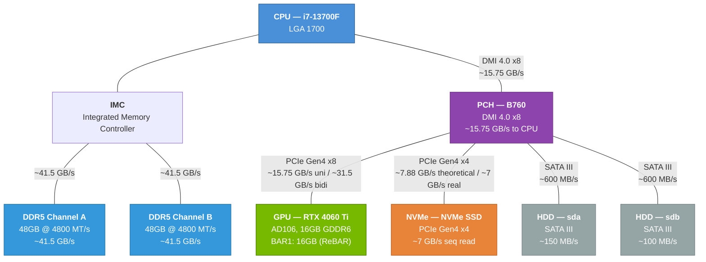
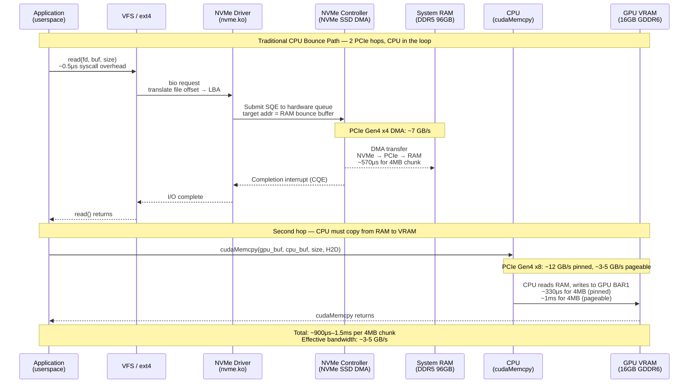
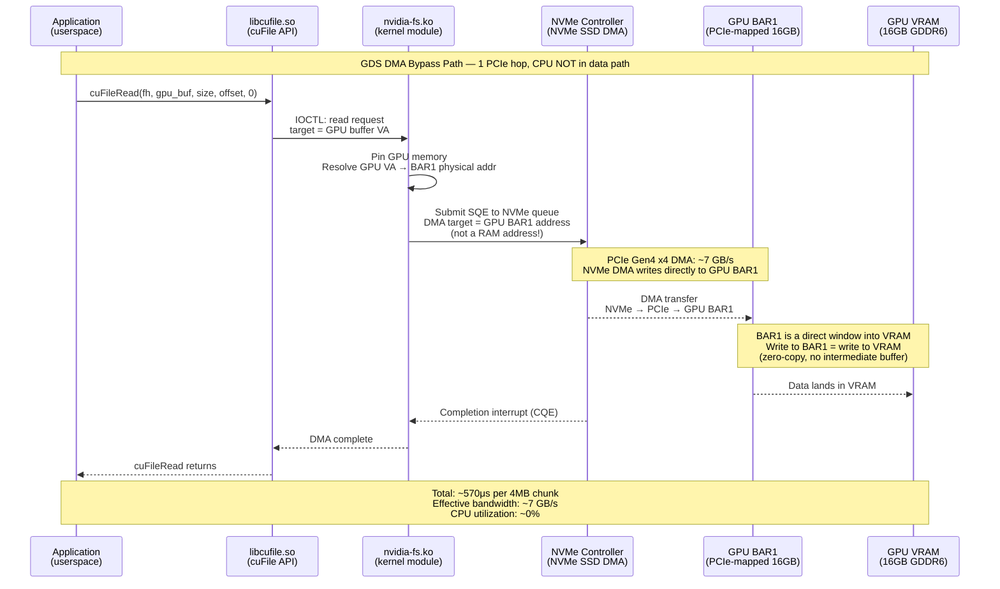
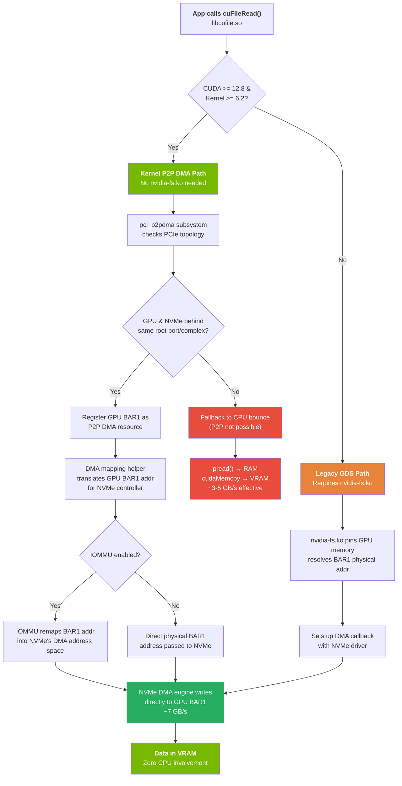
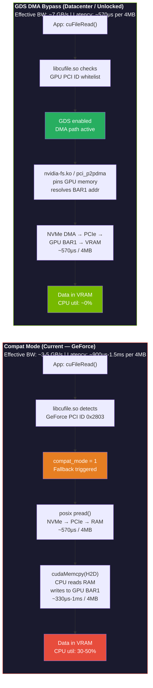
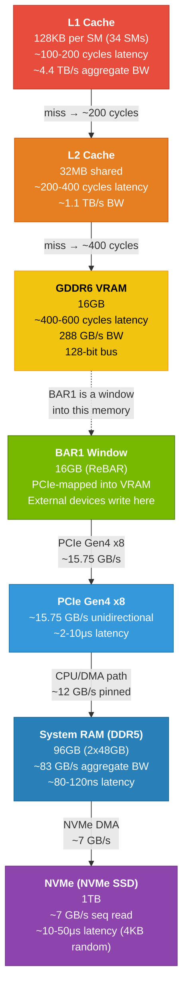
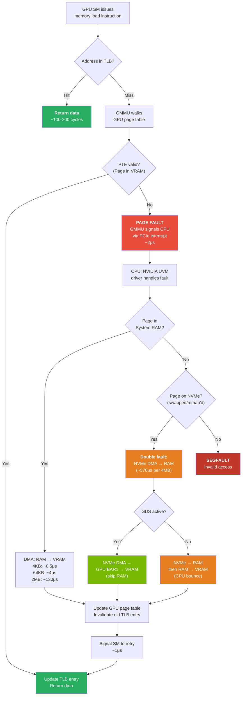
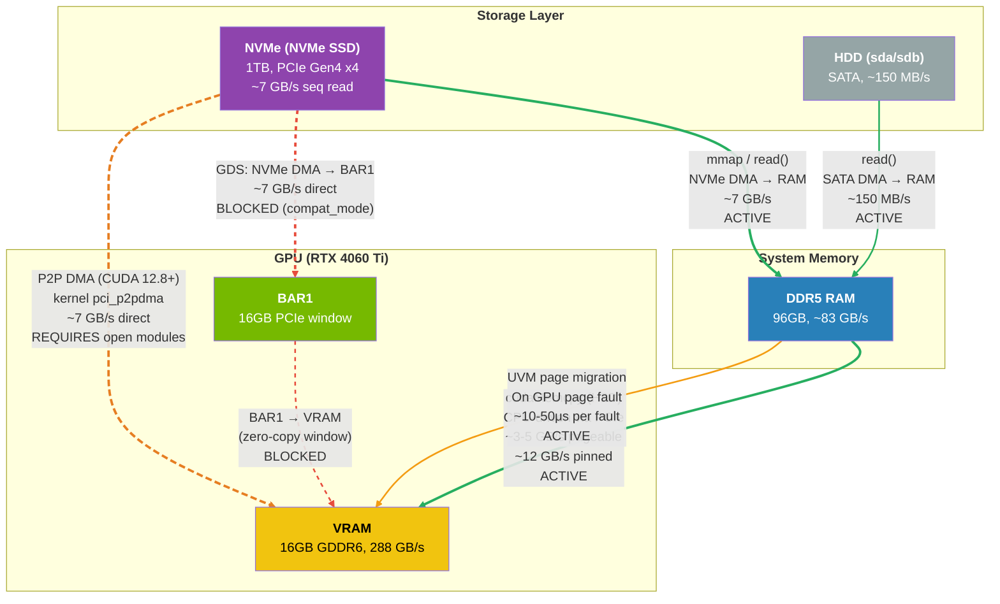

# GPUDirect Storage, DMA Bypass, and Out-of-Core Inference: A Technical Deep Dive

**For:** Understanding the complete data path from NVMe → GPU VRAM on Linux
**Hardware:** RTX 4060 Ti 16GB, 96GB DDR5, NVMe Gen4 x4, PCIe Gen4 x8
**Date:** March 17, 2026

---

## Part 1: The Physical Layer — How Data Actually Moves

### 1.1 PCIe Fundamentals

The system has three high-speed devices connected via PCIe:

```
                    ┌─────────────┐
                    │    CPU      │
                    │  i7-13700F  │
                    │             │
                    │  ┌───────┐  │
                    │  │  IMC  │  │  ← Integrated Memory Controller
                    │  └───┬───┘  │
                    │      │      │
                    └──┬───┼───┬──┘
                       │   │   │
                   ┌───┘   │   └───┐
                   │       │       │
              ┌────┴────┐  │  ┌────┴────┐
              │  DDR5   │  │  │  DDR5   │
              │ Ch A    │  │  │ Ch B    │
              │ 48GB    │  │  │ 48GB    │
              │ ~41.5   │  │  │ ~41.5   │
              │ GB/s    │  │  │ GB/s    │
              └─────────┘  │  └─────────┘
                           │
                    ┌──────┴──────┐
                    │  PCH (B760) │  ← Platform Controller Hub
                    │             │
                    ├─── PCIe x8 ─┼──► GPU (RTX 4060 Ti)
                    │   Gen4      │    15.75 GB/s unidirectional
                    │   ~15.75    │    31.5 GB/s bidirectional
                    │   GB/s      │
                    │             │
                    ├─── PCIe x4 ─┼──► NVMe (NVMe SSD)
                    │   Gen4      │    ~7 GB/s sequential read
                    │   ~7 GB/s   │
                    │             │
                    └─── SATA ────┼──► HDD (sda, sdb)
                         ~0.6    │    ~150 MB/s / ~100 MB/s
                         GB/s    │
                    └─────────────┘
```

**Key concept:** Every PCIe device has a **Base Address Register (BAR)** — a window of physical memory addresses that maps to the device's internal memory. The GPU's BAR1 is 16GB, mapping the entire VRAM address space to the PCIe bus.

#### PCIe Topology Diagram



### 1.2 How a Normal File Read Works (The CPU Bounce)

When any program calls `read()` on a file:

```
Step 1: User Process → System Call
        ┌──────────────┐
        │  Application │
        │  read(fd,    │──── syscall ────┐
        │    buf, len) │                 │
        └──────────────┘                 │
                                         ▼
Step 2: Kernel → NVMe Driver           ┌──────────────┐
        The kernel translates the       │  VFS Layer   │
        file offset to an LBA           │  (ext4, xfs) │
        (Logical Block Address)         └──────┬───────┘
        on the NVMe device.                    │
                                               ▼
Step 3: NVMe Submission Queue          ┌──────────────┐
        The NVMe driver writes a        │  NVMe Driver │
        submission queue entry (SQE)     │  (nvme.ko)   │
        to the NVMe controller.         └──────┬───────┘
                                               │
Step 4: DMA Transfer                           ▼
        NVMe controller's DMA      ┌───────────────────┐
        engine reads the SQE,       │  NVMe Controller  │
        then DMA's the data         │  (NVMe SSD)       │
        into system RAM at the      │                   │
        address specified.          │  DMA Engine ──────┼──► System RAM
                                    └───────────────────┘    (bounce buffer)
                                                             │
Step 5: CPU Copies to GPU                                    │
        If the data needs to go                              ▼
        to the GPU, the CPU does    ┌──────────────┐   ┌─────────────┐
        a second copy via PCIe:     │  cudaMemcpy  │◄──│ System RAM  │
                                    │  (CPU-driven)│   │ (DDR5)      │
                                    └──────┬───────┘   └─────────────┘
                                           │
                                           ▼
                                    ┌──────────────┐
                                    │  GPU VRAM    │
                                    │  (16GB)      │
                                    └──────────────┘
```

**Total path:** NVMe → PCIe → CPU/RAM → PCIe → GPU VRAM
**Hops:** 2 PCIe traversals + 1 CPU memory copy
**Latency:** ~100-500μs per 4KB page (varies with queue depth)
**Effective bandwidth:** ~3-5 GB/s (bottlenecked by CPU copy)

#### CPU Bounce Buffer — Sequence Diagram



### 1.3 What DMA Is

**Direct Memory Access (DMA)** is a hardware capability that allows devices to read/write system memory WITHOUT involving the CPU. Every modern device has a DMA engine — a small, dedicated hardware controller that can independently:

1. Read a source address
2. Write to a destination address
3. Signal completion via an interrupt

The NVMe controller's DMA engine is what moves data from the flash chips to system RAM in Step 4 above. The CPU doesn't move the bytes — it just sets up the transfer and waits.

**The problem:** The NVMe DMA engine can only target **system RAM addresses**. It doesn't know about GPU VRAM addresses. That's where GDS comes in.

---

## Part 2: GPUDirect Storage (GDS) — The DMA Bypass

### 2.1 The Core Idea

GDS tells the NVMe DMA engine: "Instead of writing to a system RAM address, write directly to a **GPU BAR1 address**."

Since the GPU's VRAM is exposed to the PCIe bus via BAR1 (16GB window), any PCIe device can technically DMA directly into VRAM — if the software sets up the addresses correctly.

```
WITH GDS:                               WITHOUT GDS:
NVMe → PCIe → GPU VRAM                  NVMe → PCIe → RAM → PCIe → GPU VRAM
     (1 hop, ~7 GB/s)                        (2 hops, ~3-5 GB/s effective)
```

### 2.2 How cuFile API Works (The Software Side)

```c
// Traditional approach (CPU bounce):
void* cpu_buf = malloc(size);
read(fd, cpu_buf, size);              // NVMe → RAM
cudaMemcpy(gpu_buf, cpu_buf, size);   // RAM → GPU (CPU-driven)

// GDS approach (DMA bypass):
CUfileHandle_t fh;
cuFileHandleRegister(&fh, &descr);    // Register the file with GDS
cuFileRead(fh, gpu_buf, size, 0, 0);  // NVMe → GPU (DMA, no CPU)
```

When `cuFileRead()` is called:

```
1. libcufile.so translates the call into IOCTL commands
2. These go to the nvidia-fs.ko kernel module
3. nvidia-fs.ko does:
   a. Pins the GPU memory (prevents page migration)
   b. Gets the physical GPU BAR1 address for the target buffer
   c. Sets up a DMA callback with the NVMe driver
   d. Passes the GPU physical address to the NVMe DMA engine
4. NVMe DMA engine writes directly to the GPU BAR1 address
5. Data appears in GPU VRAM without touching CPU or system RAM
```

#### GDS DMA Bypass — Sequence Diagram



### 2.3 The P2P DMA Path (CUDA 12.8+, Kernel 6.2+)

Starting with CUDA 12.8 and Linux kernel 6.2, there's a **new path** that doesn't need `nvidia-fs.ko` at all. It uses the kernel's built-in `pci_p2pdma` infrastructure:

```
Traditional GDS:     App → libcufile → nvidia-fs.ko → NVMe driver → DMA → GPU
New P2P DMA:         App → libcufile → kernel p2pdma → NVMe driver → DMA → GPU
```

The kernel's `pci_p2pdma` subsystem:
1. Checks PCIe topology (are both devices behind the same root port?)
2. Registers BAR memory as P2P resources
3. Provides DMA mapping helpers that translate GPU BAR addresses for NVMe
4. Handles IOMMU (if enabled) for address translation

**The system qualifies:** Kernel 6.17 (>> 6.2), CUDA 13.1 (>> 12.8). Both GPU and NVMe are behind the same B760 PCH.

#### P2P DMA Path Flowchart (CUDA 12.8+ / Kernel 6.2+)



---

## Part 3: The GeForce Trap — Compat Mode

### 3.1 What Actually Happens

When a GeForce GPU (like the RTX 4060 Ti) calls `cuFileRead()`:

```
1. libcufile.so checks the GPU's PCI Device ID
2. Device ID = 0x2803 (GeForce RTX 4060 Ti)
3. This ID is NOT in the "GDS-capable" whitelist
4. libcufile falls back to compat_mode = 1
5. Internally rewrites cuFileRead() as:
   a. posix pread() → data lands in system RAM
   b. cudaMemcpy() → CPU copies RAM → GPU VRAM
6. The system falls back to the traditional CPU bounce path
7. No error is raised — it "works" but slowly
```

The check is in **userspace** (libcufile.so), not in the kernel module. The kernel module (`nvidia-fs.ko`) and the hardware are both fully capable — the restriction is a software policy decision.

### 3.2 Why Windows Doesn't Have This Problem

Windows uses **WDDM (Windows Display Driver Model)** which handles GPU memory management at the OS level:

```
Windows DirectStorage Path:
1. App calls DirectStorage API (replaces Win32 ReadFile)
2. DirectStorage batches thousands of async I/O requests
3. Requests go directly to NVMe hardware queues (no kernel bounce)
4. NVMe DMA's compressed data into system RAM
5. GPU decompresses in-flight (RTX IO / GPU BC decompression)
6. WDDM dynamically pages between VRAM and system RAM
7. No GeForce/Datacenter distinction — all GPUs supported
```

**Key difference:** Windows treats GPU memory as a managed resource with transparent paging. Linux treats it as a fixed allocation where the user is responsible for placement.

### 3.3 Performance Cost of Compat Mode

For a 40GB model (Qwen 2.5 VL 72B AWQ):

| Metric | With GDS (DMA bypass) | Without GDS (compat mode) |
|---|---|---|
| Data path | NVMe → GPU (1 hop) | NVMe → RAM → GPU (2 hops) |
| Effective bandwidth | ~7 GB/s | ~3-5 GB/s |
| Load time (cold start) | ~5.7s | ~8-13s |
| Page fault latency | N/A (pinned) | ~10-50μs per 4KB page |
| CPU utilization during load | ~0% | ~30-50% (memcpy) |
| During inference (weight streaming) | GPU DMA engine prefetches | CPU copies on demand |

For token generation with weight streaming (72B model, 16GB VRAM):
- Each token requires streaming ~24GB of weights from RAM through PCIe
- **With DMA bypass:** GPU's DMA engine prefetches next layer while current layer executes
- **Without bypass:** CPU must explicitly copy each layer, creating pipeline stalls

#### GDS vs Compat Mode — Side-by-Side Comparison



---

## Part 4: The Memory Hierarchy Deep Dive

### 4.1 GPU Memory Architecture (RTX 4060 Ti)

```
┌─────────────────────────────────────────────────────┐
│                  GPU (AD106)                          │
│                                                       │
│  ┌────────────────┐  ┌────────────────────────────┐  │
│  │ SM Clusters    │  │ Memory Controllers          │  │
│  │ (34 SMs)       │  │ (8x 16-bit channels)        │  │
│  │                │  │                              │  │
│  │ ┌──────────┐   │  │  ┌──────────────────────┐   │  │
│  │ │ L1 Cache │   │  │  │ L2 Cache (32MB)      │   │  │
│  │ │ (128KB   │   │  │  │                      │   │  │
│  │ │  per SM) │   │  │  │ Hit rate: ~80-95%    │   │  │
│  │ └──────────┘   │  │  │ for inference        │   │  │
│  │                │  │  └──────────┬───────────┘   │  │
│  │ ┌──────────┐   │  │             │               │  │
│  │ │ Tensor   │   │  │             ▼               │  │
│  │ │ Cores    │   │  │  ┌──────────────────────┐   │  │
│  │ │ (136x    │   │  │  │ GDDR6 VRAM (16GB)    │   │  │
│  │ │  4th Gen)│   │  │  │ 288 GB/s bandwidth   │   │  │
│  │ │          │   │  │  │ 128-bit bus           │   │  │
│  │ │ FP8/FP16 │   │  │  └──────────────────────┘   │  │
│  │ │ INT8/TF32│   │  │                              │  │
│  │ └──────────┘   │  │  ┌──────────────────────┐   │  │
│  │                │  │  │ BAR1 (16GB)           │   │  │
│  │ ┌──────────┐   │  │  │ PCIe-mapped window   │   │  │
│  │ │ CUDA     │   │  │  │ into VRAM             │   │  │
│  │ │ Cores    │   │  │  │                       │   │  │
│  │ │ (4352x)  │   │  │  │ DMA target for GDS   │   │  │
│  │ └──────────┘   │  │  └──────────────────────┘   │  │
│  └────────────────┘  └────────────────────────────┘  │
│                                                       │
│  ┌────────────────────────────────────────────────┐  │
│  │ GPU MMU (GMMU)                                  │  │
│  │ - Translates virtual → physical GPU addresses   │  │
│  │ - Handles page faults for Unified Memory        │  │
│  │ - TLB: ~512 entries per SM                      │  │
│  │ - Page size: 4KB (small), 64KB (large), 2MB     │  │
│  │ - On TLB miss: walks GPU page table             │  │
│  │ - On page fault: signals CPU for migration      │  │
│  └────────────────────────────────────────────────┘  │
└─────────────────────────────────────────────────────┘
```

#### GPU Memory Hierarchy — Bandwidth at Each Level



### 4.2 Unified Memory Page Fault Flow

When CUDA Unified Memory (`cudaMallocManaged`) is used and the GPU accesses a page not in VRAM:

```
Timeline (microseconds):

t=0μs     GPU SM issues memory load instruction
          → TLB miss (address not in TLB)

t=0.1μs   GMMU walks GPU page table
          → PTE not valid (page not in VRAM)

t=0.5μs   GMMU raises page fault
          → Signals host CPU via PCIe interrupt

t=2μs     CPU receives interrupt
          → NVIDIA UVM driver handles fault

t=3μs     UVM driver determines page location
          → Page is in system RAM (DDR5)

t=4μs     UVM driver initiates page migration
          → Sets up DMA from RAM → VRAM

t=5μs     DMA transfer begins
          → 4KB page: ~0.5μs over PCIe
          → 64KB page: ~4μs over PCIe
          → 2MB page: ~130μs over PCIe

t=10μs    Page arrives in VRAM (for 4KB)
          → GMMU updates page table
          → TLB invalidated for old location

t=11μs    GMMU signals faulting SM to retry
          → SM resumes execution

Total: ~10-50μs per page fault (varies with page size)
```

#### Page Fault Resolution Timeline

```mermaid
gantt
    title GPU Page Fault Resolution (~10-50μs total for 4KB-64KB page)
    dateFormat X
    axisFormat %L μs

    section GPU SM
    SM issues memory load         :active, a1, 0, 1
    SM stalled (waiting)          :crit, a2, 1, 110
    SM resumes execution          :active, a3, 110, 120

    section GMMU
    TLB miss — lookup fails       :active, b1, 1, 2
    Walk GPU page table           :active, b2, 2, 5
    PTE invalid — raise fault     :crit, b3, 5, 7
    Update PTE + invalidate TLB   :active, b4, 100, 110

    section PCIe Interrupt
    Fault signal → CPU            :active, c1, 7, 20

    section CPU / UVM Driver
    Receive interrupt             :active, d1, 20, 25
    UVM handler: locate page      :active, d2, 25, 35
    Determine page in RAM         :active, d3, 35, 40
    Initiate DMA: RAM → VRAM      :active, d4, 40, 45

    section DMA Transfer
    4KB page: ~0.5μs via PCIe     :active, e1, 45, 50
    64KB page: ~4μs via PCIe      :e2, 45, 85
    2MB page: ~130μs via PCIe     :e3, 45, 175
```

#### Unified Memory Page Migration Flowchart



**For inference:** A 70B model at Q4 has ~40GB of weights. If VRAM is 16GB, ~24GB must be streamed from RAM. At 64KB pages, that's 393,216 page faults at ~15μs each = **~5.9 seconds of pure page fault overhead per full model sweep** (one token).

This is why generation speed for oversubscribed models is severely limited — the GPU spends most of its time waiting for page faults to resolve.

### 4.3 How GDS Changes This

With GDS + pinned memory, there are NO page faults:

```
1. Model file is memory-mapped from NVMe
2. cuFile pins GPU buffer in VRAM (no migration allowed)
3. NVMe DMA engine reads model weights directly into pinned VRAM
4. GPU prefetcher can overlap DMA with compute:
   - While Tensor Cores process layer N with data in VRAM
   - DMA engine loads layer N+1 from NVMe into a different VRAM region
5. Double-buffering: always one layer ahead
```

**Result:** Instead of 10-50μs page faults, the system achieves pipelined DMA with ~1-2μs per transfer setup. The tensor cores never stall waiting for data.

#### Double-Buffering Inference Pipeline — GDS vs No GDS

```mermaid
gantt
    title With GDS: Double-Buffered Weight Streaming (no stalls)
    dateFormat X
    axisFormat %L ms

    section DMA Engine
    DMA Layer 0 → Buffer A    :active, dma0, 0, 34
    DMA Layer 1 → Buffer B    :active, dma1, 34, 68
    DMA Layer 2 → Buffer A    :active, dma2, 68, 102
    DMA Layer 3 → Buffer B    :active, dma3, 102, 136
    DMA Layer 4 → Buffer A    :active, dma4, 136, 170

    section Tensor Cores
    (waiting for first load)   :crit, wait0, 0, 34
    Compute Layer 0 (Buf A)    :active, tc0, 34, 64
    Compute Layer 1 (Buf B)    :active, tc1, 68, 98
    Compute Layer 2 (Buf A)    :active, tc2, 102, 132
    Compute Layer 3 (Buf B)    :active, tc3, 136, 166
```

```mermaid
gantt
    title Without GDS: CPU Bounce — Pipeline Stalls on Every Layer
    dateFormat X
    axisFormat %L ms

    section NVMe → RAM
    NVMe DMA Layer 0 → RAM     :active, nv0, 0, 34
    NVMe DMA Layer 1 → RAM     :active, nv1, 84, 118
    NVMe DMA Layer 2 → RAM     :active, nv2, 168, 202
    NVMe DMA Layer 3 → RAM     :active, nv3, 252, 286

    section CPU memcpy
    cudaMemcpy L0 RAM→VRAM     :active, cp0, 34, 54
    cudaMemcpy L1 RAM→VRAM     :active, cp1, 118, 138
    cudaMemcpy L2 RAM→VRAM     :active, cp2, 202, 222
    cudaMemcpy L3 RAM→VRAM     :active, cp3, 286, 306

    section Tensor Cores
    (stall — waiting)           :crit, w0, 0, 54
    Compute Layer 0             :active, tc0, 54, 84
    (stall — waiting)           :crit, w1, 84, 138
    Compute Layer 1             :active, tc1, 138, 168
    (stall — waiting)           :crit, w2, 168, 222
    Compute Layer 2             :active, tc2, 222, 252
    (stall — waiting)           :crit, w3, 252, 306
    Compute Layer 3             :active, tc3, 306, 336
```





> **Key insight:** With GDS, tensor cores are idle only for the first layer load (~34ms). After that, DMA and compute overlap perfectly via double-buffering. Without GDS, every layer incurs a stall while the CPU copies data from RAM to VRAM, roughly doubling total inference time per token.

---

## Part 5: Heterogeneous Memory Management (HMM)

### 5.1 What HMM Does

HMM (available on kernel 6.1+ with NVIDIA open modules) extends the GPU's address space to include **all of system RAM** via the CPU's page tables:

```
WITHOUT HMM:
  GPU can only access: VRAM (16GB) + cudaMallocManaged memory
  System RAM requires explicit cudaMemcpy

WITH HMM:
  GPU can access: VRAM (16GB) + ALL of system RAM (96GB)
  Any pointer allocated by the CPU is accessible by the GPU
  Page faults handled transparently by the kernel
```

HMM uses the **open kernel modules'** ability to register GPU page tables with the kernel's memory management subsystem. When the GPU accesses a CPU-allocated page:

1. GPU MMU faults (page not in VRAM page table)
2. Fault goes to kernel's HMM handler (not NVIDIA UVM driver)
3. Kernel migrates the page from RAM to VRAM
4. GPU page table updated
5. GPU retries access

**Limitation:** HMM handles GPU ↔ RAM migration beautifully, but does NOT help with NVMe ↔ GPU. The initial load from NVMe still goes through the CPU bounce buffer unless GDS is active.

---

## Part 6: The Path Forward — Enabling GDS on GeForce

### 6.1 System Configuration

- ✅ CUDA 13.1 (requires ≥ 12.8 for nvidia-fs-free P2P)
- ✅ Kernel 6.17 (requires ≥ 6.2 for pci_p2pdma)
- ✅ PCIe Gen4 (both GPU and NVMe behind same PCH)
- ✅ ReBAR enabled (full 16GB BAR1 mapping)
- ❌ Open kernel modules (currently on proprietary)
- ❌ nvidia-gds package (not installed)
- ❓ P2P DMA whitelist (GPU + NVMe behind same root port?)

### 6.2 What Needs to Change

**Step 1:** Switch from proprietary to open NVIDIA kernel modules
```bash
# The open modules expose P2P DMA capabilities
# and HMM support that proprietary modules restrict
sudo apt install nvidia-driver-590-open
# Or build from source: github.com/NVIDIA/open-gpu-kernel-modules
```

**Step 2:** Enable open modules for GeForce
```bash
# Add to /etc/modprobe.d/nvidia.conf:
options nvidia NVreg_OpenRmEnableUnsupportedGpus=1
```

**Step 3:** Verify P2P DMA topology
```bash
# Check if GPU and NVMe share a root port
lspci -t  # Tree view of PCIe topology
# Both should be under the same root complex
```

**Step 4:** Install GDS tools (for benchmarking)
```bash
sudo apt install nvidia-gds
# Or just test with cuFile API via the CUDA samples
```

**Step 5:** Test P2P DMA
```bash
# CUDA 12.8+ P2P mode doesn't need nvidia-fs.ko
# It uses kernel's pci_p2pdma directly
# The gdscheck tool verifies if P2P is available:
/usr/local/cuda/gds/tools/gdscheck -p
```

### 6.3 Risk Assessment

| Risk | Severity | Mitigation |
|---|---|---|
| Open modules crash/instability | Medium | `NVreg_OpenRmEnableUnsupportedGpus` is "alpha" for GeForce |
| Wayland/KDE compositor issues | Medium | Open modules may have different DRM behavior |
| P2P DMA still blocked by firmware | Low | Hardware supports it (BAR1 = 16GB, ReBAR on) |
| No performance improvement | Low | Even partial bypass reduces CPU bounce overhead |

### 6.4 Complete System Data Flow — All Paths

The following diagram shows every data path in the system: which ones are currently active, which are blocked by the GeForce software restriction, and which become available with GDS/P2P unlocked.



> **Legend:** Solid green lines = currently active paths. Dashed red lines = paths blocked by GeForce compat_mode software restriction. Dashed orange line = path available after switching to open kernel modules + enabling P2P DMA.

### 6.5 What Success Looks Like

If P2P DMA works on the GeForce GPU:

| Metric | Current (compat mode) | With GDS P2P |
|---|---|---|
| Model cold load (40GB) | ~13s | ~5.7s |
| Weight streaming bandwidth | ~3-5 GB/s (via CPU) | ~7 GB/s (direct) |
| 72B token generation | Low | Moderate |
| CPU utilization during inference | ~30-50% | ~5% |
| GPU utilization | ~40-60% | ~80-95% |

---

## Glossary

| Term | Definition |
|---|---|
| **BAR** | Base Address Register — PCIe window mapping device memory to the CPU's address space |
| **BAR1** | GPU's BAR exposing VRAM to PCIe (16GB on the GPU with ReBAR) |
| **DMA** | Direct Memory Access — hardware copies data without CPU involvement |
| **GDS** | GPUDirect Storage — NVIDIA's framework for NVMe → GPU DMA |
| **cuFile** | GDS userspace API for direct GPU-storage I/O |
| **nvidia-fs.ko** | Kernel module for traditional GDS (not needed with CUDA 12.8+ P2P) |
| **pci_p2pdma** | Linux kernel subsystem for peer-to-peer DMA between PCIe devices |
| **GMMU** | GPU Memory Management Unit — translates virtual to physical GPU addresses |
| **HMM** | Heterogeneous Memory Management — extends GPU address space to system RAM |
| **WDDM** | Windows Display Driver Model — Windows' GPU memory management framework |
| **compat_mode** | GDS fallback that uses CPU bounce buffer instead of DMA bypass |
| **Pinned memory** | GPU memory that cannot be migrated/paged — required for DMA targets |
| **Page fault** | GPU access to unmapped memory that triggers CPU intervention |
| **TLB** | Translation Lookaside Buffer — cache of virtual→physical address mappings |
| **SQE** | Submission Queue Entry — NVMe command descriptor |

---

## References

* [1] NVIDIA Technical Blog. *GPUDirect Storage: A Direct Path Between Storage and GPU Memory*. https://developer.nvidia.com/blog/gpudirect-storage/
* [2] NVIDIA Docs. *GPUDirect Storage Installation and Troubleshooting Guide, Release r1.16*. https://docs.nvidia.com/gpudirect-storage/troubleshooting-guide/
* [3] NVIDIA Docs. *GPUDirect Storage Design Guide*. https://docs.nvidia.com/gpudirect-storage/design-guide/
* [4] NVIDIA Docs. *GDS cuFile API Reference Guide*. https://docs.nvidia.com/gpudirect-storage/api-reference-guide/
* [5] NVIDIA Docs. *GPUDirect RDMA*. https://docs.nvidia.com/cuda/gpudirect-rdma/
* [6] NVIDIA Technical Blog. *Simplifying GPU Application Development with Heterogeneous Memory Management*. https://developer.nvidia.com/blog/simplifying-gpu-app-dev-with-heterogeneous-memory-management/
* [7] Linux Kernel Docs. *PCI Peer-to-Peer DMA Support*. https://docs.kernel.org/driver-api/pci/p2pdma.html
* [8] NVIDIA Docs. *CUDA Programming Guide — Unified Memory*. https://docs.nvidia.com/cuda/cuda-programming-guide/04-special-topics/unified-memory.html
* [9] NVIDIA GitHub. *open-gpu-kernel-modules*. https://github.com/NVIDIA/open-gpu-kernel-modules
* [10] NVIDIA GitHub. *gds-nvidia-fs*. https://github.com/NVIDIA/gds-nvidia-fs
