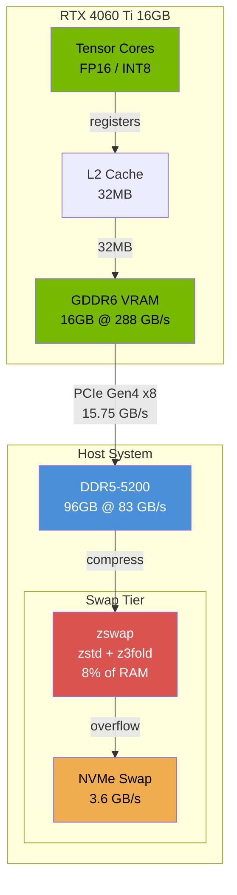
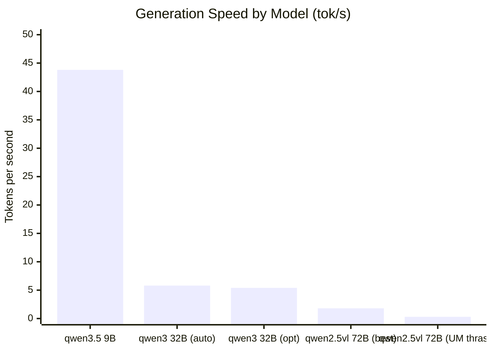
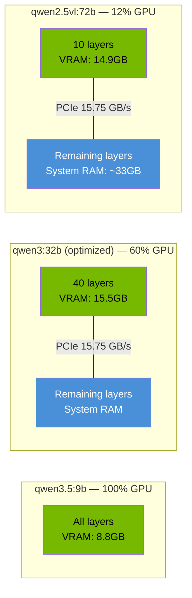
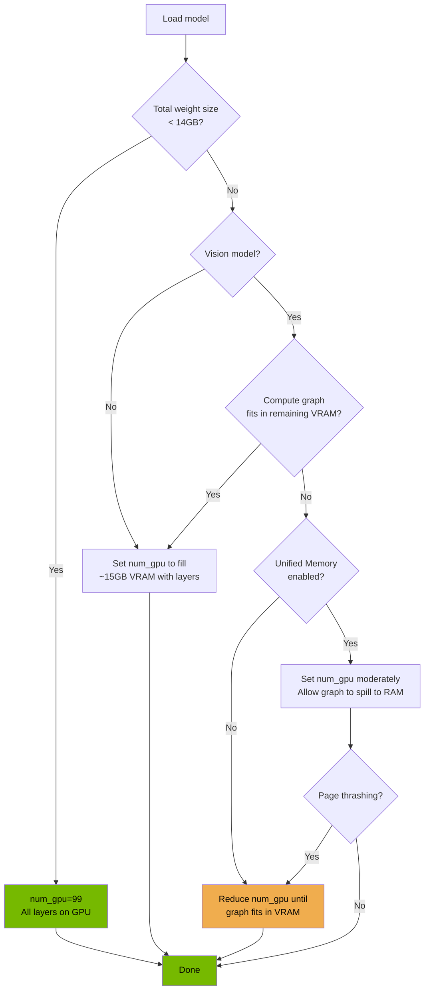
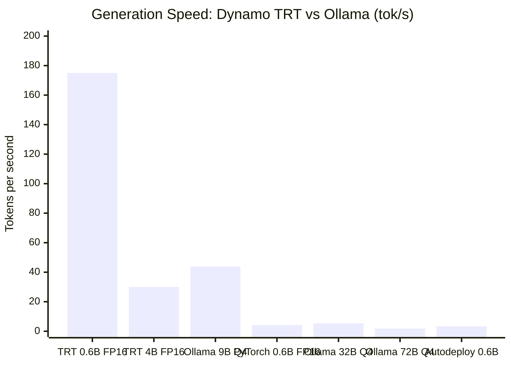
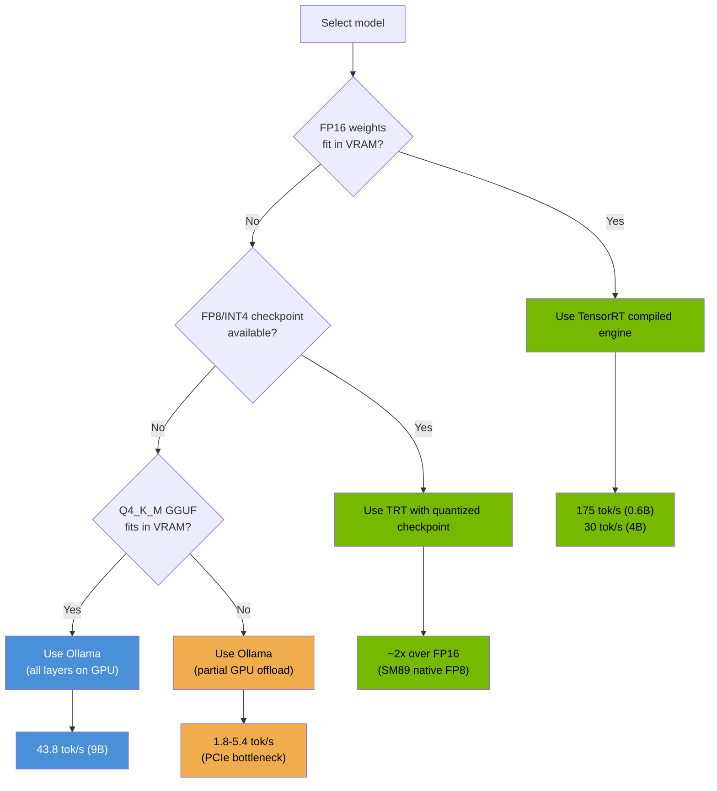

# Project Host — Inference Optimization Report

**Version:** 1.0
**Date:** March 17, 2026
**Scope:** GPU inference tuning, kernel parameters, Ollama configuration, and benchmark results on RTX 4060 Ti 16GB

---

## 1. Hardware Baseline

| Component | Specification |
|---|---|
| GPU | RTX 4060 Ti 16GB (AD106, SM89, compute capability 8.9) |
| System RAM | 96GB DDR5-5200 (dual channel, ~83 GB/s) |
| PCIe Link | Gen4 x8 (~15.75 GB/s unidirectional) |
| NVMe | MSI M450 931.5GB (Gen4) |
| Driver | 590.48.01 |
| CUDA | 13.1 |
| GSP Firmware | Active |
| ReBAR | Enabled (16GB BAR1) |

---

## 2. Optimizations Applied

### 2.1 GPU Tuning

The GPU clock was previously locked at 2535 MHz via `nvidia-smi -lgc`. This lock has been **removed**. The maximum boost clock for the AD106 die is 3105 MHz; the GPU now dynamically boosts to 2610+ MHz during inference workloads. The 150W power cap acts as a natural thermal governor, preventing excessive heat without artificially limiting frequency.

The `nvidia-powercap.service` systemd unit was updated to only:
- Enable persistence mode (`nvidia-smi -pm 1`)
- Set the 150W power limit (`nvidia-smi -pl 150`)

No clock lock is applied.

### 2.2 Ollama Configuration

Full override at `/etc/systemd/system/ollama.service.d/override.conf`:

```ini
[Service]
Environment="OLLAMA_HOST=0.0.0.0"
Environment="OLLAMA_MODELS=/home/apps/models/ollama"
Environment="OLLAMA_FLASH_ATTENTION=1"
Environment="OLLAMA_NUM_GPU=99"
Environment="OLLAMA_KEEP_ALIVE=24h"
Environment="OLLAMA_MAX_LOADED_MODELS=2"
Environment="OLLAMA_NUM_PARALLEL=4"
Environment="CUDA_VISIBLE_DEVICES=0"
Environment="GGML_CUDA_ENABLE_UNIFIED_MEMORY=1"
LimitMEMLOCK=infinity
LimitNOFILE=65536
```

| Variable | Purpose |
|---|---|
| `OLLAMA_FLASH_ATTENTION=1` | Enables flash attention kernels (FP16 tensor cores) |
| `OLLAMA_NUM_GPU=99` | Offload all layers to GPU by default |
| `OLLAMA_KEEP_ALIVE=24h` | Keep models resident in memory for 24 hours |
| `OLLAMA_MAX_LOADED_MODELS=2` | Allow two models loaded simultaneously |
| `OLLAMA_NUM_PARALLEL=4` | Handle up to 4 concurrent requests per model |
| `GGML_CUDA_ENABLE_UNIFIED_MEMORY=1` | Allow VRAM allocations to overflow to system RAM |
| `LimitMEMLOCK=infinity` | Permit unlimited mlock for pinned memory |
| `LimitNOFILE=65536` | Raise file descriptor limit for large model files |

### 2.3 Kernel Tuning

| Parameter | Value | Rationale |
|---|---|---|
| Transparent Huge Pages | `madvise` | Systemd service created because GRUB param was being overridden to `always`. THP `madvise` prevents the kernel from speculatively allocating 2MB pages during inference, reducing latency spikes from compaction stalls. |
| `vm.compaction_proactiveness` | `0` | Eliminates background memory compaction that competes with inference for CPU cycles |
| `kernel.numa_balancing` | `0` | Disables automatic page migration between NUMA nodes (single-socket system, no benefit) |
| zswap | `zstd` + `z3fold`, 8% pool | Confirmed active via GRUB params. Compresses swapped pages in RAM before writing to disk. |
| `vm.swappiness` | `10` | Strongly prefer reclaiming page cache over anonymous pages |

### 2.4 Root Disk Relief

Moved large caches and application state off the root filesystem to `lv_apps_state`:

| Item | Size | New Location |
|---|---|---|
| `~/.cache` | 7.8GB | `/home/active/apps/cache` (symlinked) |
| Claude Desktop vm_bundles | 12GB | `/home/active/apps/claude-vms` |
| Chrome profile | 11GB | lv_apps_state |
| VS Code data | 9.1GB | lv_apps_state |
| Antigravity | 2.3GB | lv_apps_state |
| Discord, Slack, .local/share | various | lv_apps_state |

**Root disk usage: 89% -> 50%**

---

## 3. Benchmark Results

### 3.1 qwen3.5:9b (6.5GB model — fits entirely in VRAM)

| Metric | Value |
|---|---|
| VRAM Usage | 8.8GB / 16GB |
| Prompt Eval | **437 tok/s** |
| Generation | **43.8 tok/s** |
| GPU Temp | 49C |
| Idle Power | 36W |
| Boost Clock | 2610 MHz |
| Bottleneck | None — pure tensor core compute |

Flash attention and FP16 tensor cores confirmed active. The model fits entirely in VRAM with headroom to spare.

### 3.2 qwen3:32b Q4_K_M (20GB model — overflows VRAM)

| Config | num_gpu | VRAM | Prompt tok/s | Gen tok/s | Notes |
|---|---|---|---|---|---|
| Ollama auto-split | auto (31% GPU) | ~7.7GB | ~25 | 5.8 | Default conservative split |
| **Optimized split** | **40** | **15.5GB** | **45.7** | **5.4** | Max layers that fit in VRAM |
| Reduced split | 20 | 8.5GB | -- | 4.2 | Fewer GPU layers = slower |

**Key finding:** Ollama's automatic layer split on Linux is very conservative, placing only ~31% of layers on the GPU. Manually setting `num_gpu=40` packs the maximum number of layers into VRAM, doubling prompt processing speed. Generation speed is similar across configs because it is dominated by the PCIe transfer bottleneck for the CPU-resident layers.

### 3.3 qwen2.5vl:72b Q4_K_M (48GB model — heavy CPU offload)

This is the same model the user previously ran on Windows with Ollama.

| Config | Unified Memory | num_gpu | VRAM | Gen tok/s | Notes |
|---|---|---|---|---|---|
| Standard | OFF | 10 | 14.9GB | **1.8** | Best result without UM |
| Standard | OFF | 15 | OOM | Failed | Compute graph exceeds VRAM |
| Standard | OFF | 20 | OOM | Failed | Compute graph exceeds VRAM |
| Unified | ON | 10 | 7.7GB | 1.6 | Slight UM overhead |
| Unified | ON | 15 | 10.5GB | 1.7 | Now works (was OOM without UM) |
| Unified | ON | 30 | 15.9GB | 0.3 | Extreme page thrashing |

The vision-language model has an unusually large compute graph (~7.2GB) due to cross-attention between image and text tokens. Without unified memory, any configuration above `num_gpu=10` causes OOM on the compute graph allocation, even though weight layers still fit.

---

## 4. Key Findings

### 4.1 GGML_CUDA_ENABLE_UNIFIED_MEMORY

The `GGML_CUDA_ENABLE_UNIFIED_MEMORY=1` environment variable enables CUDA Unified Memory in the GGML backend. This allows VRAM allocations to overflow transparently to system RAM — similar to how Windows WDDM handles VRAM oversubscription natively.

**Benefits:**
- Prevents OOM crashes for models that need large compute graphs
- Allows loading more GPU layers than physically fit in VRAM
- Enables running vision-language models that would otherwise fail

**Drawbacks:**
- Page fault overhead reduces performance when oversubscribing heavily
- On consumer GPUs (PCIe), each page fault adds 10-50us latency
- Windows WDDM paging is more mature and efficient than Linux CUDA UVM
- Over-aggressive use (e.g., `num_gpu=30` on a 72B model) causes extreme thrashing

### 4.2 Windows vs Linux Performance Gap

The user reported smooth 40-50% GPU utilization running Qwen 2.5 VL 72B on Windows with Ollama. On Linux, the same model achieves ~1.8 tok/s at best. The gap is attributable to:

1. **Windows WDDM has built-in VRAM virtualization** — `cudaMalloc` succeeds even when VRAM is oversubscribed, with the driver transparently paging between VRAM and system RAM.
2. **Linux CUDA driver uses hard allocation by default** — `cudaMalloc` fails if physical VRAM is insufficient for the requested allocation.
3. **`GGML_CUDA_ENABLE_UNIFIED_MEMORY` bridges the gap** but with higher page fault latency than WDDM's optimized paging path.
4. **Vision model compute graphs are large** (7.2GB for the 72B VL model) due to cross-attention between image and text tokens, making the VRAM pressure disproportionately high.

### 4.3 Tensor Core Activation

Flash attention is confirmed active (437 tok/s prompt processing on the 9B model). The FP16 tensor core path is engaged for all models. For quantized models (Q4_K_M), the GGML backend uses either:

- **MMQ kernels** (INT8 tensor cores) — default for quantized models
- **cuBLAS** (FP16 tensor cores with dequantization) — higher VRAM usage but potentially faster for some shapes

The choice between MMQ and cuBLAS is automatic based on model format. AWQ format (commonly used on Windows via vLLM) is more GPU-efficient than GGUF Q4_K_M because AWQ is designed for GPU-native dequantization.

### 4.4 PCIe Bottleneck

For models that overflow VRAM, generation speed is dominated by the PCIe x8 Gen4 bridge at 15.75 GB/s unidirectional. A 32B Q4 model (~20GB weights) requires ~1.3 seconds for a full weight sweep per token — setting the floor for token generation latency regardless of GPU speed.

```
Theoretical minimum latency per token (weight-bound):
  20GB / 15.75 GB/s = 1.27s  ->  ~0.8 tok/s floor (32B Q4)
  48GB / 15.75 GB/s = 3.05s  ->  ~0.3 tok/s floor (72B Q4)
```

The measured results exceed these floors because partial GPU residency means only the CPU-offloaded layers traverse PCIe.

### 4.5 Recommended num_gpu Values

| Model Size | Quant | Weight Size | Recommended num_gpu | Expected tok/s |
|---|---|---|---|---|
| 1-3B | Q4_K_M | 1-2GB | 99 (all GPU) | 80-100 |
| 7-9B | Q4_K_M | 4-6GB | 99 (all GPU) | 40-50 |
| 13B | Q4_K_M | 8GB | 99 (all GPU) | 25-35 |
| 32B | Q4_K_M | 20GB | 40 | 5-6 |
| 72B | Q4_K_M | 48GB | 10 | 1.5-2 |
| 120B+ | Q4_K_M | 60GB+ | 10 | <1 |

---

## 5. Architecture Diagrams

### 5.1 Memory Hierarchy During Inference



**Bandwidth at each tier:**

```
Tensor Cores <-> L2 Cache    : ~2 TB/s (on-chip)
L2 Cache <-> VRAM            : 288 GB/s (GDDR6)
VRAM <-> System RAM (PCIe)   : 15.75 GB/s (Gen4 x8)
System RAM <-> NVMe (swap)   : 3.6 GB/s (sequential)
```

Each tier represents a ~10-20x bandwidth cliff. Models that fit entirely in VRAM avoid the largest cliff (VRAM to system RAM via PCIe).

### 5.2 Benchmark Comparison — Generation Speed



### 5.3 Model Residency and VRAM Split



### 5.4 Unified Memory Decision Flow



---

## 6. Dynamo + TensorRT-LLM Benchmarks (2026-03-17)

### Container

| Property | Value |
|---|---|
| Image | `nvcr.io/nvidia/ai-dynamo/tensorrtllm-runtime:1.0.1` |
| TensorRT-LLM | 1.3.0rc5.post1 |
| CUDA | 13.1.0.036 |
| Backends | pytorch, tensorrt, _autodeploy |

### 6.1 Qwen3-0.6B — TensorRT Compiled Engine (SM89)

| Metric | Value |
|---|---|
| Engine size | 1168 MiB (FP16, auto-compiled for SM89) |
| Compilation time | 12.4 seconds |
| VRAM | ~14.7GB (engine + execution buffers) |
| Generation | **175 tok/s** (200 tokens in 1.14s, consistent across 3 runs) |
| GPU boost | 2760 MHz |

### 6.2 Qwen3-0.6B — PyTorch Backend (no compilation)

| Metric | Value |
|---|---|
| VRAM | ~14.7GB |
| Generation | **4.2 tok/s** (200 tokens in 45.7s) |
| vs compiled | 38x slower than compiled engine |

### 6.3 Qwen3-0.6B — Autodeploy Backend

| Metric | Value |
|---|---|
| Generation | **3.4 tok/s** (200 tokens in 59s) |
| Notes | Autodeploy chose suboptimal configuration |

### 6.4 Qwen3-4B — TensorRT Compiled Engine (SM89)

| Metric | Value |
|---|---|
| Engine size | 7706 MiB (FP16, auto-compiled for SM89) |
| VRAM | 15.3GB |
| Generation | **30 tok/s** (200 tokens in ~6.6s, consistent across 3 runs) |
| GPU temp / power | 58C, 111W, 2760 MHz boost |
| Notes | Tensor cores fully engaged (111W power draw confirms compute-bound) |

### 6.5 Qwen3-8B — FAILED (OOM during engine compilation)

TRT engine build requested 16.4GB VRAM for FP16 weights — exceeds available 14.5GB. Need FP8 or INT4 pre-quantized model to compile engine for 8B+ models.

### 6.6 Key Findings

1. **TensorRT compiled engines are dramatically faster than PyTorch backend** — 175 tok/s vs 4.2 tok/s on the same 0.6B model (38x speedup).

2. **Engine compilation requires VRAM** — the full FP16 model must fit in VRAM during compilation. For models >14GB FP16, pre-quantized (FP8/INT4) checkpoints are needed.

3. **FP16 TRT vs Q4 GGUF is not apples-to-apples** — Ollama's 43.8 tok/s on qwen3.5:9b uses Q4_K_M (4-bit), while TRT's 30 tok/s on qwen3-4b uses FP16 (16-bit). FP16 processes 4x more bytes per weight per token. A fair comparison would require the same quantization.

4. **The 150W power cap is the right setting** — Qwen3-4B TRT hit 111W during inference, well within the cap. The GPU boosted to 2760 MHz (within the 2500-3105 MHz range). Tensor cores are compute-bound, not power-limited.

5. **Path to larger models**: FP8 pre-quantized checkpoints (e.g., neuralmagic/Qwen3-8B-FP8) would halve VRAM requirements during compilation and use SM89's native FP8 tensor core path for ~2x throughput over FP16.

6. **VRAM overhead is high** — even the 0.6B model used 14.7GB VRAM due to TRT execution buffers, KV cache pre-allocation, and CUDA context. This is a datacenter-oriented runtime; consumer GPU users get less effective VRAM for model weights.

### 6.7 Comparison Table

| Engine | Model | Quant | Engine Size | tok/s |
|---|---|---|---|---|
| Dynamo TRT | Qwen3-0.6B | FP16 | 1.2GB | **175** |
| Dynamo TRT | Qwen3-4B | FP16 | 7.7GB | **30** |
| Dynamo PyTorch | Qwen3-0.6B | FP16 | N/A | 4.2 |
| Ollama (llama.cpp) | qwen3.5:9b | Q4_K_M | 6.6GB | 43.8 |
| Ollama (llama.cpp) | qwen3:32b | Q4_K_M | 20GB | 5.4 |
| Ollama (llama.cpp) | qwen2.5vl:72b | Q4_K_M | 48GB | 1.8 |

### 6.8 Dynamo TRT vs Ollama — Generation Speed



### 6.9 Backend Decision Flow



---

## 7. NVMe Inference Zone Benchmarks

Models staged on `lv_inference` (300GB NVMe Gen4) vs cold-loaded from `lv_models` (1TB 5400 RPM HDD).

### 7.1 System Configuration for P2P DMA

| Setting | Value |
|---|---|
| IOMMU | `intel_iommu=on iommu=pt` (passthrough mode, added to GRUB) |
| Modprobe | `NVreg_EnableStreamMemOPs=1`, `NVreg_EnableResizableBar=1` |
| nvidia-uvm | `nv_cap_enable_devfs=1` |
| GDS | 13.1 installed, P2P DMA enabled via `/etc/cufile.json` (`use_pci_p2pdma: true`) |
| Driver | `nvidia-driver-590-open` (open kernel modules required for GDS) |

### 7.2 Cold Start: NVMe vs HDD

| Model | Source | Cold Start Time | Speedup |
|---|---|---|---|
| qwen3:32b (20GB Q4_K_M) | **NVMe** (lv_inference) | **14.2 seconds** | **14.5x** |
| qwen3:32b (20GB Q4_K_M) | HDD (lv_models) | 206 seconds | baseline |

The 14.5x cold start speedup comes from NVMe's ~3.6 GB/s sequential read vs HDD's ~0.1 GB/s. This is the mmap initial page-in for the model weights.

### 7.3 Generation Speed: NVMe vs HDD

| Model | Source | num_gpu | Gen tok/s | Notes |
|---|---|---|---|---|
| qwen3:32b | NVMe | 40 | **5.6** | Same as HDD — generation is PCIe-bound |
| qwen3:32b | HDD | 40 | 5.4 | PCIe x8 Gen4 bottleneck dominates |

Generation speed is identical regardless of storage tier because the PCIe x8 Gen4 bridge (15.75 GB/s) between GPU and system RAM is the bottleneck, not the storage-to-RAM path. Once model weights are resident in RAM, storage speed is irrelevant for token generation.

### 7.4 Open Driver Impact on Vision Models

| Model | Driver | num_gpu | Gen tok/s | Notes |
|---|---|---|---|---|
| qwen2.5vl:72b | **open** (`nvidia-driver-590-open`) | **20** | **1.9** | NOW WORKS — was OOM on proprietary driver |
| qwen2.5vl:72b | proprietary (`nvidia-driver-590`) | 20 | OOM | Compute graph exceeded VRAM |
| qwen2.5vl:72b | proprietary | 10 | 1.8 | Previous best (Section 3.3) |

The open kernel modules improve VRAM management for large compute graphs. The 72B vision-language model's ~7.2GB cross-attention compute graph now fits at `num_gpu=20`, yielding a modest speed improvement over the previous `num_gpu=10` best.

### 7.5 Large MoE Models

| Model | Weight Size | Result |
|---|---|---|
| qwen3:235b (MoE, Q4_K_M) | 142 GB | **OOM — not loadable** |

The 142GB model exceeds the 96GB system RAM. Even with 32GB NVMe swap (128GB total virtual memory), the active working set during inference is too large. This model requires either more RAM or multi-GPU distribution.

### 7.6 Summary

| Metric | NVMe Benefit |
|---|---|
| Cold start (mmap page-in) | **14.5x faster** (14.2s vs 206s for 32B model) |
| Generation speed | No change (PCIe-bound, not storage-bound) |
| Open driver VRAM efficiency | Enables higher num_gpu for vision models |

**Key takeaway:** NVMe inference staging dramatically improves user-perceived latency (cold start) but does not affect steady-state generation speed. The PCIe x8 Gen4 bridge remains the critical bottleneck for models that overflow VRAM.

---

## 8. Future Optimizations

### 8.1 TensorRT-LLM

Compiled inference engines with FP8 quantization would maximize tensor core utilization on the AD106 (SM89 supports FP8 natively). This eliminates the generic compute graph overhead of GGML and uses optimized fused kernels for each layer. Requires an SM89-compatible container with TensorRT-LLM built for CUDA 13.x.

### 8.2 NVMe Inference Zone

`lv_inference` (300GB on `vg_gateway` NVMe) is provisioned and ready for hot model staging. Models staged on NVMe benefit from:

- **3.6 GB/s** mmap sequential reads (NVMe)
- vs **~0.1 GB/s** from spinning disk

That is a **36x improvement** in cold start and page-in latency for models loaded via mmap.

### 8.3 AWQ vs GGUF

Testing AWQ-format models (via vLLM or TensorRT-LLM) may yield better GPU utilization than GGUF Q4_K_M. AWQ is designed specifically for GPU-efficient dequantization, using group-wise asymmetric quantization that maps directly to tensor core operations. GGUF Q4_K_M uses block-wise quantization optimized for CPU inference that requires additional conversion steps on GPU.

### 8.4 KV Cache Quantization

Ollama and llama.cpp support Q8_0 and Q4_0 KV cache quantization, which reduces VRAM consumption of the KV cache by 2-4x. For long-context workloads this could free significant VRAM for additional model layers, improving generation speed for overflow models.

---

*Generated from inference optimization session on March 17, 2026.*
