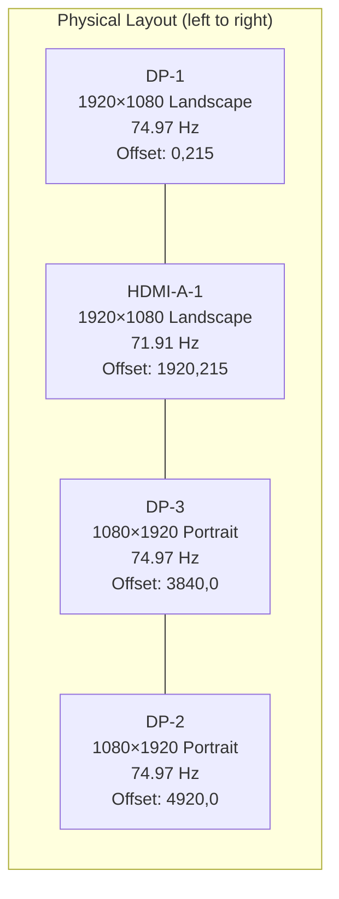

[< Back to Index](README.md)

## 14. KWin / Compositor

**File:** `~/.config/kwinrc`

### Compositor Settings

| Setting | Value | Rationale |
|---------|-------|-----------|
| MaxFPS | 75 | Matches highest monitor refresh (74.97 Hz) — no wasted frames |
| EdgeBarrier | 75 | Prevents mouse/windows seeping across monitor edges |
| CornerBarrier | true | Same protection at corners |
| Blur | Disabled | Saves GPU cycles for inference |
| Backend | Wayland (KWin) | Native Wayland — better latency, NVIDIA modesetting support |

### Monitor Layout



| Output | Resolution | Orientation | Refresh | Position |
|--------|-----------|-------------|---------|----------|
| DP-1 | 1920×1080 | Landscape | 74.97 Hz | 0,215 |
| HDMI-A-1 | 1920×1080 | Landscape | 71.91 Hz | 1920,215 |
| DP-3 | 1080×1920 | Portrait | 74.97 Hz | 3840,0 |
| DP-2 | 1080×1920 | Portrait | 74.97 Hz | 4920,0 |

### Shader Cache Nuke (if compositor misbehaves)

```bash
rm -rf ~/.nv/GLCache/ ~/.cache/nvidia/ ~/.cache/kwin/
# Then restart KWin or reboot
```

**Verify:**
```bash
kscreen-doctor -o
cat ~/.config/kwinrc | grep -E "MaxFPS|EdgeBarrier|Blur"
```
