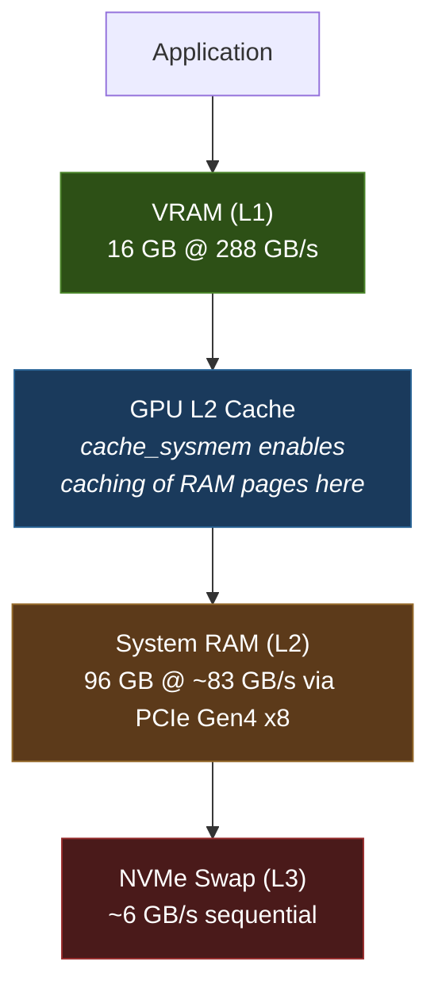

[< Back to Index](README.md)

## 4. NVIDIA UVM (GPU Direct Memory)

**File:** `/etc/modprobe.d/nvidia-uvm-optimized.conf`

```
options nvidia-uvm uvm_exp_gpu_cache_sysmem=1 uvm_exp_gpu_cache_peermem=1
options nvidia-uvm uvm_perf_prefetch_threshold=75 uvm_perf_prefetch_min_faults=1
```

| Option | Value | Purpose |
|--------|-------|---------|
| `uvm_exp_gpu_cache_sysmem` | 1 | GPU L2 cache can cache system RAM pages — bypasses CPU for repeated access to host memory |
| `uvm_exp_gpu_cache_peermem` | 1 | Same caching behavior for peer GPU memory |
| `uvm_perf_prefetch_threshold` | 75 | Aggressive prefetch — triggers after 75% sequential access pattern. Optimized for LLM weight streaming. |
| `uvm_perf_prefetch_min_faults` | 1 | Start prefetching after a single fault — minimal latency before prefetch kicks in |
| `uvm_global_oversubscription` | 1 | Allows GPU memory allocation beyond physical VRAM, spilling to system RAM transparently |

**Module:** `nvidia_fs` (GPU Direct Storage) is loaded for direct NVMe-to-GPU transfers, bypassing CPU and system RAM for bulk data loads.

**Requires reboot or driver reload** (`sudo rmmod nvidia_uvm && sudo modprobe nvidia_uvm`) to activate changes.

### GPU Memory Hierarchy



The UVM `cache_sysmem` flag is the key optimization: when a model exceeds VRAM, layers spill to system RAM. Without this flag, every access to those layers traverses PCIe. With it, the GPU L2 cache retains hot RAM pages, reducing effective latency for repeated tensor access.

**Verify:**
```bash
# Check module options
cat /sys/module/nvidia_uvm/parameters/uvm_exp_gpu_cache_sysmem
cat /sys/module/nvidia_uvm/parameters/uvm_perf_prefetch_threshold
# Check nvidia_fs loaded
lsmod | grep nvidia_fs
```
