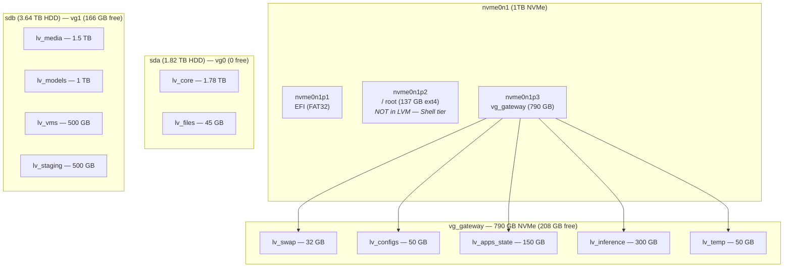

[< Back to Index](README.md)

## 13. LVM / Storage Topology

### Layout



### Volume Details

| VG | PV | LV | Size | Mount | Purpose |
|----|----|----|------|-------|---------|
| — | nvme0n1p1 | — | 1.1 GB | `/boot/efi` | EFI System Partition |
| — | nvme0n1p2 | — | 137 GB | `/` | Root filesystem (ext4, not LVM) — Shell tier |
| vg_gateway | nvme0n1p3 | lv_swap | 32 GB | swap | Partition swap |
| vg_gateway | nvme0n1p3 | lv_configs | 50 GB | `/home/active/configs` | Identity, dotfiles, configuration |
| vg_gateway | nvme0n1p3 | lv_apps_state | 150 GB | `/home/active/apps` | Docker data, app state |
| vg_gateway | nvme0n1p3 | lv_inference | 300 GB | `/home/active/inference` | Inference workloads, hot model staging |
| vg_gateway | nvme0n1p3 | lv_temp | 50 GB | `/home/active/temp` | Swap files, temp data |
| vg0 | sda | lv_core | 1.78 TB | `/home/core` | Development, projects, programs |
| vg0 | sda | lv_files | 45 GB | `/home/core/files` | User files |
| vg1 | sdb | lv_media | 1.5 TB | `/home/media` | Media storage |
| vg1 | sdb | lv_models | 1 TB | `/home/apps/models` | ML model storage |
| vg1 | sdb | lv_vms | 500 GB | `/home/apps/vms` | VM disk images |
| vg1 | sdb | lv_staging | 500 GB | `/home/staging` | Staging area |

### User Home (`/home/aj`)

The user home directory lives on the root partition (`/`). Large application data directories are symlinked to `/home/core/programs/` (SATA) to keep root usage low:

| Symlink | Target | Size | Notes |
|---------|--------|------|-------|
| `~/Unity` | `/home/core/programs/Unity` | ~15 GB | Unity Hub + Editor |
| `~/.docker` | `/home/core/programs/.docker` | ~17 GB | Docker Desktop data |

**Root space policy:**
- Root (`/`) should stay below 80% usage — it is the Shell tier, meant to be disposable
- Large applications (Electron apps, game engines, IDEs) should install to `/home/core/programs/` with symlinks back to `~/`
- npm/pip/cargo caches regenerate automatically and can be cleaned with `npm cache clean --force`, etc.
- Run `df -h /` periodically to check; a monitoring cron is recommended (see below)

### Future: Dedicated User Home LV

`vg_gateway` has **208 GB free** on the NVMe. A dedicated LV for `/home/aj` would permanently isolate user state from the Shell tier:

```bash
# Create 120 GB LV
sudo lvcreate -L 120G -n lv_user vg_gateway
sudo mkfs.ext4 -L User /dev/vg_gateway/lv_user

# Migrate data (from TTY, logged out of aj session)
sudo mkdir /mnt/newuser
sudo mount /dev/vg_gateway/lv_user /mnt/newuser
sudo rsync -aHAXx /home/aj/ /mnt/newuser/
sudo umount /mnt/newuser
sudo mv /home/aj /home/aj.bak
sudo mkdir /home/aj
sudo mount /dev/vg_gateway/lv_user /home/aj

# Add to fstab
echo '/dev/vg_gateway/lv_user  /home/aj  ext4  defaults,noatime  0 2' | sudo tee -a /etc/fstab

# After reboot + verification: sudo rm -rf /home/aj.bak
```

This would add `lv_user` to the Gateway tier, aligning with the Shell/Gateway/Core architecture.

### fstab

```
# Root Partition (System)
UUID=ab00834b-4100-4d94-ad80-e69a676562c6   /               ext4    errors=remount-ro 0       1

# EFI Boot Partition
UUID=8B76-075D                              /boot/efi       vfat    umask=0077      0       2

# === vg_gateway (NVMe Gen4 — /dev/nvme0n1p3) ===
/dev/vg_gateway/lv_swap        none                    swap    sw                              0 0
/dev/vg_gateway/lv_configs     /home/active/configs    ext4    defaults,noatime                0 2
/dev/vg_gateway/lv_apps_state  /home/active/apps       ext4    defaults,noatime                0 2
/dev/vg_gateway/lv_inference   /home/active/inference  ext4    defaults,noatime                0 2
/dev/vg_gateway/lv_temp        /home/active/temp       ext4    defaults,noatime                0 2

# === vg0 (1.82TB 7200 RPM HDD — /dev/sda) ===
/dev/vg0/lv_core               /home/core              ext4    defaults,nofail                 0 2
/dev/vg0/lv_files              /home/core/files        ext4    defaults,nofail                 0 2

# === vg1 (3.64TB 5400 RPM HDD — /dev/sdb) ===
/dev/vg1/lv_media              /home/media             ext4    defaults,nofail                 0 2
/dev/vg1/lv_models             /home/apps/models       ext4    defaults,nofail                 0 2
/dev/vg1/lv_vms                /home/apps/vms          ext4    defaults,nofail                 0 2
/dev/vg1/lv_staging            /home/staging           ext4    defaults,nofail                 0 2
/home/active/temp/swapfile_static.img none swap pri=10,nofail 0 0
```

**Verify:**
```bash
lsblk -o NAME,SIZE,TYPE,MOUNTPOINT
sudo vgs
sudo lvs
df -h /
swapon --show
```
