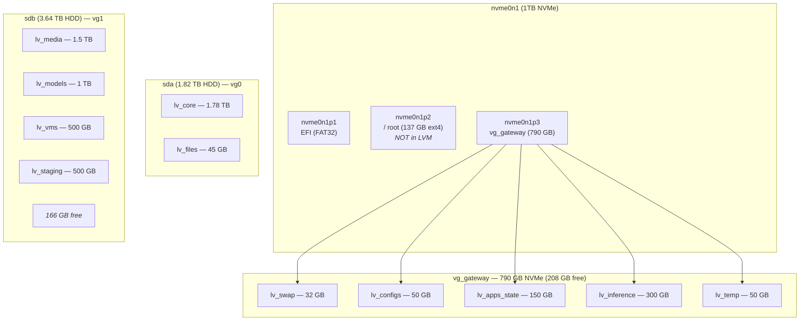

[< Back to Index](README.md)

## 13. LVM / Storage Topology

### Layout



### Volume Details

| VG | PV | LV | Size | Mount | Purpose |
|----|----|----|------|-------|---------|
| — | nvme0n1p1 | — | — | `/boot/efi` | EFI System Partition |
| — | nvme0n1p2 | — | 137 GB | `/` | Root filesystem (ext4, not LVM) |
| vg_gateway | nvme0n1p3 | lv_swap | 32 GB | swap | Partition swap (priority -2) |
| vg_gateway | nvme0n1p3 | lv_configs | 50 GB | `/home/core` | Configuration, projects, dotfiles |
| vg_gateway | nvme0n1p3 | lv_apps_state | 150 GB | `/home/active/apps` | Docker data, app state |
| vg_gateway | nvme0n1p3 | lv_inference | 300 GB | `/home/active/inference` | Inference workloads, model caches |
| vg_gateway | nvme0n1p3 | lv_temp | 50 GB | `/home/active/temp` | Swap files, temp data |
| vg0 | sda | lv_core | 1.78 TB | `/home/apps` | Applications, Ollama models, VMs |
| vg0 | sda | lv_files | 45 GB | `/home/files` | User files |
| vg1 | sdb | lv_media | 1.5 TB | `/home/media` | Media storage |
| vg1 | sdb | lv_models | 1 TB | `/home/apps/models` | ML model storage |
| vg1 | sdb | lv_vms | 500 GB | `/home/apps/vms` | VM disk images |
| vg1 | sdb | lv_staging | 500 GB | `/home/staging` | Staging area |

### fstab

```
# <device>                              <mount>               <type>  <options>                    <dump> <pass>
/dev/nvme0n1p1                           /boot/efi             vfat    umask=0077                   0      1
/dev/nvme0n1p2                           /                     ext4    errors=remount-ro            0      1
/dev/vg_gateway/lv_configs               /home/core            ext4    defaults                     0      2
/dev/vg_gateway/lv_apps_state            /home/active/apps     ext4    defaults                     0      2
/dev/vg_gateway/lv_inference             /home/active/inference ext4   defaults                     0      2
/dev/vg_gateway/lv_temp                  /home/active/temp     ext4    defaults                     0      2
/dev/vg_gateway/lv_swap                  none                  swap    sw,pri=-2                    0      0
/dev/vg0/lv_core                         /home/apps            ext4    defaults                     0      2
/dev/vg0/lv_files                        /home/files           ext4    defaults                     0      2
/dev/vg1/lv_media                        /home/media           ext4    defaults                     0      2
/dev/vg1/lv_models                       /home/apps/models     ext4    defaults                     0      2
/dev/vg1/lv_vms                          /home/apps/vms        ext4    defaults                     0      2
/dev/vg1/lv_staging                      /home/staging         ext4    defaults                     0      2
/home/active/temp/swapfile_static.img    none                  swap    sw,pri=10                    0      0
```

**Verify:**
```bash
lsblk -o NAME,SIZE,TYPE,MOUNTPOINT
sudo vgs
sudo lvs
swapon --show
```
