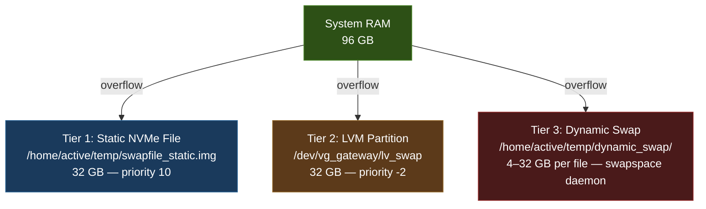

[< Back to Index](README.md)

## 10. Swap / L3 Memory Fabric

Three tiers provide graduated overflow from RAM to storage:



### Tier 1: Static NVMe Swap File (highest priority)

- **Path:** `/home/active/temp/swapfile_static.img`
- **Size:** 32 GB
- **Priority:** 10
- **Configured in:** `/etc/fstab`
- NVMe-speed swap — first to be used

### Tier 2: LVM Partition (always on)

- **Device:** `/dev/vg_gateway/lv_swap`
- **Size:** 32 GB
- **Priority:** -2
- **Configured in:** `/etc/fstab`
- Fallback after static file fills

### Tier 3: Dynamic (swapspace daemon)

**File:** `/etc/swapspace.conf`
```
swappath="/home/active/temp/dynamic_swap"
lower_freelimit=20
upper_freelimit=60
freetarget=30
min_swapsize=4g
max_swapsize=32g
cooldown=300
```

| Setting | Value | Purpose |
|---------|-------|---------|
| `swappath` | `/home/active/temp/dynamic_swap` | Directory for dynamic swap files |
| `lower_freelimit` | `20` | Create swap when free memory drops below 20% |
| `upper_freelimit` | `60` | Remove swap when free memory exceeds 60% |
| `freetarget` | `30` | Target 30% free memory when creating swap |
| `min_swapsize` | `4g` | Minimum swap file size |
| `max_swapsize` | `32g` | Maximum swap file size |
| `cooldown` | `300` | Wait 5 minutes between swap adjustments |

**Verify:**
```bash
swapon --show
systemctl status swapspace
free -h
```
